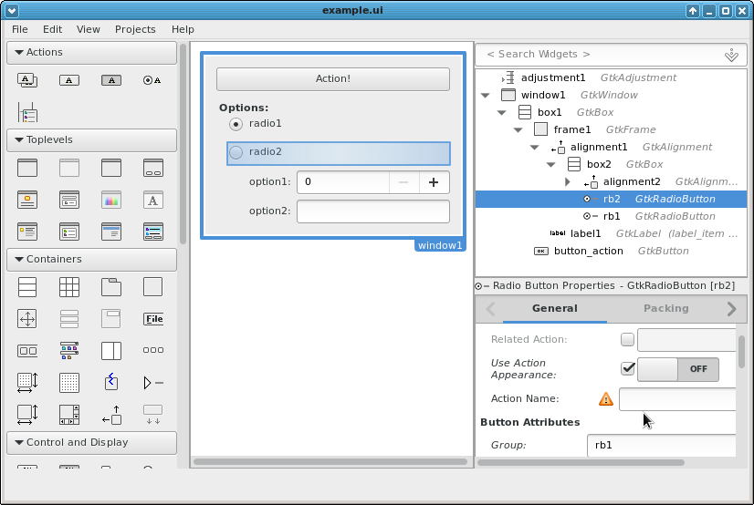
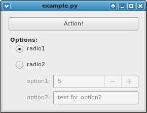
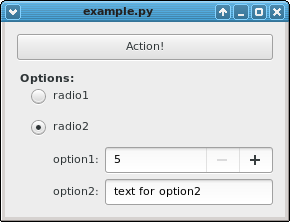

.. |Swig| replace:: *Swig*

.. |glade| replace:: *Glade*

.. |pygtk| replace:: *PyGTK*
.. |python| replace:: *Python*

.. |mvco| replace:: *MVC--O*
.. |mvc| replace:: *MVC* pattern
.. |obs| replace:: *Observer* pattern
.. |gui| replace:: *GUI*
.. |pygtkmvc| replace:: *pygtkmvc*
.. |vc| replace:: *V&C*

###################
gtkmvc in 5 minutes
###################

The goal of this example is not to provide an explanation of *how*
gtkmvc works (see the rest of the documentation), but to present a quick example
about how complexity and dependencies of an application can be reduced by
using gtkmvc.

The example in details
======================

In the example, the view shows some options that control some mechanism within
the logic of the application.  There are two top-level options ``rb1`` and
``rb2`` which are in one group and therefore are mutually exclusive. ``rb2``
has sub-options ``option1`` and ``option2`` which make sense only when ``rb2``
is selected.

In the glade file, ``button_action`` has signal ``clicked`` associated to
function ``on_button_action_clicked``, and signal ``delete`` of ``window1``
is associated with ``on_window1_delete_event``. 

The Source Code
===============

View
----

The glade file can be loaded into a *view*::

 import gtk
 from gtkmvc import View
 class MyView (View):
     builder = "example.glade"
     top = "window1"

     def enable_rb2(self, flag):
         """enables/disables all widgets regarding rb2"""
         self['table1'].set_sensitive(flag)
         return
       
     pass # end of class

For the glade file the format ``gtk.Builder`` should be used, ``Libglade`` is
deprecated since version 1.9.2.

Model
-----

The application's logic is contained into the *model*::

 from gtkmvc import Model
 class MyModel(Model):
     use_rb1 = True
     option1 = 5
     option2 = "text for option2"
       
     __observables__ = ("use_rb1", "option1", "option2")

     def do_action(self):
         print "model performs action:", \
             self.use_rb1, self.option1, self.option2
         return

     pass # end of class

Controller
----------

The *controller* couples the *model* and the *view*::

    from gtkmvc import Controller
    class MyController(Controller):

        def register_adapters(self):
            self.adapt("use_rb1", "rb1")
            self.adapt("option1")
            self.adapt("option2")
            return
          
        # signals handling
        def on_button_action_clicked(self, button):
            self.model.do_action()
            return

        def on_window1_delete_event(self, w, e):
            gtk.main_quit()
            return False
        
        # observable assignment notifications
        @Controller.observe("use_rb1", assign=True)
        def use_rb1_change(self, model, prop_name, info):
            self.view.enable_rb2(not info.new)
            return
          
        pass # end of class

* Controllers react on ``signals`` (like ``on_button_action_clicked()``) from the
  view.
* They observe properties of the *model* (like ``use_rb1_change()``).
* Special entities called *Adapters* take care of keeping aligned
  automatically the logic in the model and the values shown in the view.

MVC Triplet
-----------

Now it is needed to instantiate the MVC triplet and run the gtk main
loop::

    if "__main__" == __name__:
        m = MyModel() 
        v = MyView()  
        c = MyController(m, v)
        gtk.main()

That's it. You can find the full source code of this micro example
under in the *example* folder of the source code.

Why this example is interesting
===============================

The *key* to understand the example, is in the fact that there is no
code binding the user action of enabling option ``rb1`` with the result
of having sub-options of ``rb2`` grayed out. Instead, when the user
selects ``rb1``, property ``use_rb1`` in the model gets assigned to value
``True``. That's it for this control flow, there is no return of
information, and no assumptions about semantics of other options.

Having the value of the options stored into the model is correct, as
options are used by the model's action which is part of the
application logic.

What happens then? Since the controller is an observer of property
``use_rb1`` in the model, when the value gets changed, the controller is
notified and it can then take the right actions accordingly to the new
value.

In the end ''the sub-options get gray-out not because the user
selected ``rb1``, but because the *logic* of the application says
they are no longer available''.

If there were other views/controllers pair or observers of the model,
they might take similar actions according to their semantics, without
any of the involved parts know about the existence of the others.

If communication is split into *unidirectional* with no return,
crossing or branching flows, the application gets a more robust
structure, with high locality and low dependencies. 
