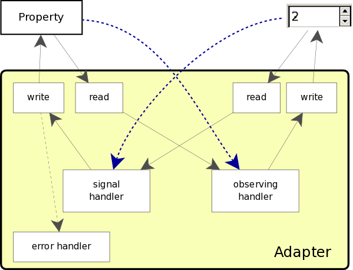
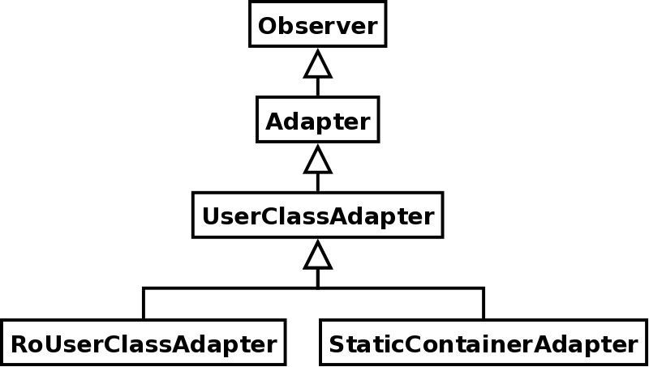

.. _Adapters:

Adapters
********

Version 1.2 introduces *Adapters*, a powerful feature that
makes the framework perform some standard and boring activities
autonomously.

Introduction
============

Previous sections presented the framework and its main feature, that
is -- to recap it once again -- to provide a full support for
separating the logical and the presentation sides of an
application. This separation is featured by the *MVC* pattern and the
*Observer* pattern.

Although features are important, *goals* are the driving
targets that lead the framework development. Most important goals of
the framework are to keep simplicity, transparency and lightness,
and to bear the level of abstraction high whilst still allowing to
control and customise lower levels.

It is the case that the framework forces and helps to both design
and implement applications in a clean and robust way. 

However, sometimes things get complicated even for simple
designs. In particular *Controllers* tend to blow up in size and
complexity when handling a *View* containing many widgets, and
when observing many properties into the *Model*. Also, since the
framework can handle several kinds of observable properties (*OPs*),
developers are required to remember and use some naming conventions
for notifications methods defined inside *Observers*. Conventions
contributes to make things that would be easy too complex.

In particular, when a default behaviour is expected, the
*Controller* gets filled in with many methods whose code follows
a template that is identically repeated all over again.

For example, let us suppose it is needed to have a text entry always
aligned with some part of the model. This would require to have a
textual observable property into the model, a signal handler into
the controller to handle the ``'changed'`` signal, and a
method to handle notification for observable property value
changes. When a ``'changed'`` signal arrives, the
corresponding signal handler should read the text entry value and
report it to the observable property into the model. Viceversa, when
the observable property in the model get changed for any reason, the
notification code into the controller should update the text entry
value. The handlers' code should also avoid to fall into a
reciprocal loop.

It is in this context that adapters become pretty nifty. 

What Adapters are
=================

*Adapters* are the generalization of the the code that handles
autonomously the connection between a set of widgets and a
corresponding set of properties (possibly observable) to keep
aligned automatically the logical and the presentation sides, and to
keep low the complexity of controllers.

.. _ADAP_f:

   Schematic simple adapter

In figure :ref:`ADAP_f` is represented a simple adapter, where main
internal functional blocks are shown. There exist functional blocks
to control (and possibly customise) the way the property and the
widget are read and written. Also, there is a functional block to
manage how errors are handled when exceptions occur when writing
into the property.

An Adapter *adapts* widgets and model's properties. Adapters
offer strong customization, but in their simplest use they are
pretty easy to be used. In this context, previous example might be
handled as follows.

We have a hand-made View containing a button and a text
entry. Notice that the name of the text entry is
``entry_text``. ::

 class MyView (gtkmvc.View):
     def __init__(self):
         gtkmvc.View.__init__(self)
 
         w = gtk.Window(); e = gtk.Entry(); b = gtk.Button("Press")
         h = gtk.VBox(); h.add(e); h.add(b); w.add(h)
         w.show_all()
         self['entry_text'] = e
         self['button'] = b        
         return
 
     pass # end of class

The model contains an observable property that should always 
reflect the content of the text entry ``entry_text``. ::

 class MyModel (gtkmvc.Model):
     text : "Ciao"
     __observables__ = ("test",)
 
     pass # end of class

As usual, the controller is the most complex part, but by exploiting
an adapter it gets pretty much simplified. ::

 class MyCtrl (gtkmvc.Controller):
     def register_adapters(self):
         self.adapt("text")
         return
 
     def register_view(self, view):
         view['button'].connect('clicked', self.on_button_clicked)
         return
 
     # signal handles
     def on_button_clicked(self, button):
         print "Text is:'%s'" % self.model.text
         return
 
     pass # end of class

The idea in this example is to have "button"
that when pressed makes model's observable property ``text``
printed out to the standard output.

No code is included to handle "entry_text" "change"
signal and observable property value change notifications. Instead,
a new method surfaces off the controller:
``register_adapters``.

This method is called at the right time by the framework and it is a
good place where adapters can be created and connected. In the
example, creation occurs through a call to another new method of
class Controller: ``adapt``.

The new method is pretty complex and will be discussed in depth
later. Enough to say now that parameter ``"text"``
represents the name of the observable property that we want to
adapt. The corresponding widget is searched among all widgets in the
view, and widget ``entry_text`` is found and connected
automatically. The way this magic happens is not important at this
stage, but soon you will introduced with all details, to make you
know how to fully exploit and control this new feature.

.. _ADAP1_f:

.. figure:: images/adap1.png
   :width: 12 cm
   :align: center

   Simple adapter at work

The code that instantiates and runs this example is as usual: ::

 m = MyModel()
 v = MyView()
 c = MyCtrl(m,v)
 gtk.main()

File ``examples/adapters/simple.py`` contains the full source
code of this example. When being run, it shows up a window
containing the text entry and the button. When the button is
pressed, the content of the observable property ``text`` is
printed to the standard output. Initially, ``text`` is
assigned to ``"Ciao"`` and the text entry reflects it
accordingly.

If the user changes the text in the entry, the property
``text`` will be changed accordingly, as it is easy to check
by clicking the button. Viceversa, if the property ``text``
were changed by another model, observer, etc., the text entry would
get updated accordingly.

Module ``adapters``
===================

Currently, module ``adapters`` contains a few adapters
classes.

``Adapter``
   Connects a widget and a property. The
   property cannot be a container or a user-defined class.

``UserClassAdapter``
   This class handles the
   communication between a widget and a class instance that is a
   property inside the model.
 
``RoUserClassAdapter``
   This is similar to
   ``UserClassAdapter``, but dedicated to read-only class
   instances. Used internally to handle for example
   ``datetime`` properties, when connecting a
   ``gtk.Calendar``.
 
``StaticContainerAdapter``
   This class can be used to
   bound a set of widgets to a single property that is a container,
   like a tuple, a list or a map, or in general a class that
   implements ``__getitem__`` and
   ``__setitem__`` methods.

.. _ADAPuml_f:

   Adapters class hierarchy

Class ``Adapter``
^^^^^^^^^^^^^^^^^

This is the base class for all adapters. All adapters derive from
class ``Observer``. Instantiation of an Adapter can be
optionally complex and customizable by using same optional
parameters. Available parameters are presented here, but examples
will show them applied in a practical manner. 

Important operations are:

Constructor
   Class constructor gets several parameters, but
   only two are strictly required. ::

    def __init__(self, model, prop_name, 
                 prop_read=None, prop_write=None, 
                 value_error=None)

   ``model``
      is the Model instance containing the
      property to be observed.
   
   ``prop_name``
      is the model's property name (as a
      string). It is possible to use a dotted notation to identify a
      property contained into a hierarchy of models. For example
      'a.b.c' identifies property 'c' into model 'b' inside model 'a',
      where model 'a' is an attribute of given top level model. Last
      name can be an observable or non-observable attribute, and
      previous names (if specified) must all refer to instances of
      class ``Model``. First name from the left must be the
      name of a model instance inside the given model.
   
   ``prop_read``
      optional function that apply custom
      modifications to the value of the property before reading
      it. The function takes a value and must return a transformed
      value. Use to customize the way the property is read, and to
      apply useful transformations to the read value.
   
   ``prop_write``
      Like ``prop_read`` optional
      function that apply custom modifications to the value of the
      property before writing it. The function takes a value and must
      return a transformed value whose type must be compatible with
      the type of the property. Use to customize the way the property
      is written, and to apply useful transformations to the value.
   
   ``value_error``
      optional parameter that can be a
      function (or a method) to be called when a ``ValueError``
      exception occurs while trying to set a wrong value for the
      property inside the model. The function will receive: the
      adapter, the property name and the value coming from the widget
      that offended the model. Useful to catch and handle error
      conditions.

Widget connection
   Constructor connects properties, while
   widgets are connected through method ``connect_widget``: ::

    def connect_widget(self, widget,
                       getter=None, setter=None, 
                       signal=None, arg=None, update=True)

   widget
      is the widget that is needed to connect
   getter
      optional function used to "read" the
      widget. The function receives a widget instance.
   setter
      optional function used to "write" the
      widget. The function receives a widget instance and the value to
      be written.
   signal
      Optional name of the signal that will be used to
      monitor the widget changes.
   arg
      Optional argument that is passed to the signal
      handler. It will be used when connecting the signal.
   update
      If False, the widget will be not initially updated
      with the initial value of the property. Used in very particular
      conditions.

update_model()
   Forces the property to be updated from the
   value hold by the widget. This method should be called directly by
   the user in very unusual conditions.

update_widget()
   Forces the widget to be updated from the
   property value. This method should be called directly by the user
   when the property is not observable, or in very unusual conditions.

At this step thorough people would be asking them self how
instantiation of adapters can work in its simplest option, i.e. by
specifying the minimal set of parameters, and exploiting all default
values for the others.

The framework searches information about widgets and possible default
values for any unspecified parameter into module
``adapters.default``. The module exports two functions to add and
remove default adapters at runtime. These function are:

add_adapter
   to add a new default adapter.

remove_adapter
   to remove a default adapter.

Suppose for example that the specified widget is a
``gtk.Entry``. Good candidates for unspecified
``getter`` and ``setter`` would be
``gtk.Entry.get_text`` and ``gtk.Entry.set_text``
respectively. ``signal`` will be ``"changed"`` to
capture events that change the value of the widget.

Later a list of all currently supported widgets will be presented.

Class ``UserClassAdapter``
^^^^^^^^^^^^^^^^^^^^^^^^^^

This class handles the communication between a widget and a class
instance (possibly observable) that is a property inside the
model. The value to be shown is taken and stored by using a getter
and a setter. getter and setter can be: names of user class methods,
bound or unbound methods of the user class, or a function that will
receive the user class instance and possible arguments whose number
depends on whether it is a getter or a setter.

Class ``UserClassAdapter`` derives directly from class
``Adapter`` and redefines the constructor as follow. ::

 def __init__(self, model, prop_name,
              getter, setter, 
              prop_read=None, prop_write=None,                   
              value_error=None):

Where ``getter`` and ``setter`` are two new required
parameters, and all the other are unchanged.

``getter``
   can be a string holding the name of the
   user class method, a bound or unbound method of the user class, or
   a function that will receive the user class instance. The function
   or method is required to return the value to be read into the user
   class.
 
``setter``
   can be a string holding the name of the
   user class method, a bound or unbound method of the user class, or
   a function that will receive the user class instance and a value
   for setting. 

Class ``StaticContainerAdapter``
^^^^^^^^^^^^^^^^^^^^^^^^^^^^^^^^

This class can be used to bound a set of widgets to a property that
is a container, like a tuple, a list or a map, or in general a class
that implements ``__getitem__`` and
``__setitem__`` methods.

From the other hand, the set of widgets can be a list provided by
the user, or a container widget like a Box, a Notebook, etc.
Widgets will be linked by their position when the property is
list-like, or by their names or instances when the property is
map-like.

This class supports only properties that are static containers,
i.e. those containers that do not change their length
dynamically. If the container grows up in length, no change will
occur in the view-side.

This class derives from class ``UserClassAdapter``.

Widget connection
   Different than Adapter's method,
   ``connect_widget`` accepts sets. ::
 
    def connect_widget(self, widget,
                       getters=None, setters=None, 
                       signals=None, arg=None)
 
 
widget
   is either a container widget, or a list of widgets. 
getters
   optional function or list or a map of functions used
   to "read" the widget(s). Each function receives a widget
   instance.
setters
   optional function or list or a map of functions used
   to "write" the widget(s). Each function receives a widget
   instance and value for setting.
 
signal
   can be None, a signal name, or a list or a map of
   signal names.
 
arg
   Optional argument that is passed to each signal
   handler. It will be used when connecting the signal(s). 

When maps are used, keys can be widgets or widget names. The length
of the possible lists or maps must be lesser or equal to the number
of widgets that will be connected.

update_model(idx=None)
   Updates the value of property at
   given index. If ``idx`` is ``None``, all controlled
   indices will be updated. This method should be called directly by
   the user in very unusual conditions.
 
update_widget(idx=None)
   Forces the widget at given index to
   be updated from the property value. If index is not given, all
   controlled widgets will be updated. This method should be called
   directly by the user when the property is not observable, or in
   very unusual conditions.

Since things got a bit convoluted here, some examples can help to
understand how this kind of adapter can be used. 

Suppose you have a glade file containing a button and a
``HBox`` called ``"hbox"`` containing a text entry, a
label and a ``SpinButton``.

.. _ADAP2_f:

.. figure:: images/adap2.png
   :width: 6 cm
   :align: center

   ``StaticContainerAdapter`` at work

The view is simply: ::

 class MyView (View):
     glade = "adapters.glade"
     top = "window"
     pass # end of class

The model contains a tuple of three integers that we want to connect
to the widgets into the ``HBox``. When the button is clicked,
one of the three integers is randomly incremented. ::

 class MyModel (Model):
     box = [0,1,2]
     __observables__ = ("box",)
     pass # end of class

The controller handles the button click signal: ::

 import random
 class MyCtrl (Controller):
     def on_button_clicked(self, button):
         self.model.box[random.randint(0,2)] += 1
         return
     pass # end of class

If typically construction of adapters occurs into method
``register_adapters`` for the sake of simplicity in this
example instantiation of the adapter is located in the main
launching code: ::

 m = MyModel()
 v = MyView()
 c = MyCtrl(m, v)
 
 a = StaticContainerAdapter(m, "box")
 a.connect_widget(v["hbox"])
 
 gtk.main()

Adaption of widgets occur by their position into the
``"hbox"`` container. 

Second example makes use of an explicit list of widgets, and
exploits also parameter ``setters`` to customize the way the
label ``"lbl"`` shows its value. ::

 m = MyModel()
 v = MyView()
 c = MyCtrl(m, v)
 
 a1 = StaticContainerAdapter(m, "box")
 a1.connect_widget(map(lambda x: v[x], "en lbl sb".split()), 
                   setters = {'lbl': lambda w, v: 
                      w.set_markup("<big>Val: <b>%d</b></big>" % v)})
 
 gtk.main()

.. _ADAP3_f:

.. figure:: images/adap3.png
   :width: 6 cm
   :align: center

   Customized setter for the label

Finally, instead of being a tuple, the observable property can be
also a map, whose keys are widget names. ::

 class MyModel (Model):
     box = { 'en'  : 0,
             'lbl' : 1,
             'sb'  : 2 }
     __observables__ = ("box",)
     pass # end of class

in this case bounding between widgets and values into the property
in the model is carried out by looking at names, and not position.

Support for adapter instantiation
=================================

As already seen, since version 1.2 class ``Controller``
offers two new methods to support instantiation of adapters. 

register_adapters()
   This method is called by the framework
   when it is the best time to create all adapters. All that users
   are required to do is to override this method into their
   controllers derived from ``Controller``.
 
adapt(...)
   This method can be used within
   ``register_adapters`` to adapt properties and
   widgets. Arguments can be one of the following:

   * Property name as a string. A corresponding widget is
     searched among view's widgets and if only one match is found, a
     default adapter is created. The type of the created adapter
     depends both on the property and the widget type. Widget name
     matching is performed by searching the property name into widget
     names, case insensitive.
 
   * Property name and widget name. Like previous but widget name
     is explicitly declared.
 
   * An instance of an Adapter. The adapter must be already
     connected to a widget.
 
   The first two flavors of method ``adapt`` allows for an
   easy construction of a default adapter, but only the third allows
   for a full control.

.. _SUPW:

Supported widgets
=================

Here follows the list of those widgets that are currently supported
by the framework out of the box. In method
``Controller.adapt`` when adapting a widget, it is searched
into this list a matching and one or more adapters are created.

If no matching is found, a fallback tentative is to connect to
widget signal ``"changed"`` if there exists. If this fails,
an assertion is raised.

If a widget is not listed here, it does not mean that it is not
supported. Instead, it will be enough to specify all required
parameters when instantiating adapters.

=========================  ========================================  =======================
Widget type                Property type                             Notes
=========================  ========================================  =======================
``gtk.Adjustment``         ``types.FloatType``                       Currently set value
``gtk.Arrow``              ``gtk.ArrowType``                         Current direction
``gtk.Calendar``           ``datetime``, ``date`` or ``int`` triple  Selected day
``gtk.CheckMenuItem``      ``types.BooleanType``                     Current toggle state
``gtk.ColorButton``        ``gtk.gdk.Color``                         Selected colour 
``gtk.ColorSelection``     ``gtk.gdk.Color``                         Selected colour
``gtk.ComboBox``           ``types.IntType``                         Model index of the currently selected item
``gtk.Entry``              ``types.StringType``                      Current entry content 
``gtk.Expander``           ``types.BooleanType``                     True iff expanded
``gtk.FileChooserButton``  ``types.StringType``                      Selected file name
``gtk.Label``              ``type.StringType`` or number             Label content
``gtk.LinkButton``         ``type.StringType``                       Currently set URI
``gtk.RadioAction``        ``type.StringType``                       Label of selected action in the radio group
``gtk.RadioButton``        ``type.StringType``                       Label of selected button in the radio group
``gtk.ToggleAction``       ``types.BooleanType``                     Current toggle state
``gtk.ToggleButton``       ``types.BooleanType``                     Current toggle state
``gtk.ToggleToolButton``   ``types.BooleanType``                     Current toggle state
=========================  ========================================  =======================

Fur further information about default adapters, see module
``adapters.default`` and functions
``adapters.default.add_adapter`` and
``adapters.default.remove_adapter``.

