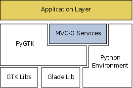

Architectural Overview
**********************

Figure :ref:`HLA_f` shows the high level software architecture for an
application based on *PyGTK* and the supplied *MVC-O* Infrastructure. It
shows the functional architecture as well.

.. _HLA_f:

   Overview of the architecture

In terms of functionalities, at the highest level is located the
*Application Layer*, which is partially based on the *MVC-O*
Infrastructure, and whose implementation depends on the application
semantics. The impact of the framework is intended to be as much
little as possible. 

The *MVC-O Services Layer* supplies a quasi-generic platform
which implements the *MVC* pattern and the *Observer* pattern. As the figure :ref:`HLA_f`
depicts, the *MVC-O* layer is partially based on *PyGTK* in order to
provide supports for the view and controller parts. Furthermore, model
part may access *PyGTK* when using the *MVC* pattern provided by *PyGTK* itself,
like for example ``TextBuffer`` or ``TreeModel``
objects. However in general the model part is indenpended on the
specific graphical toolkit.

Lower layers supply several functionalities concerning the
graphical toolkit (GTK and *Glade*), Object Relational Mapping
(ORM) libraries, the Scripting Environment (namely Python), and
other possible libraries providing application-specific features.

