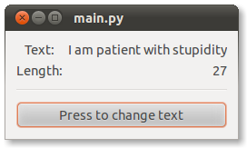
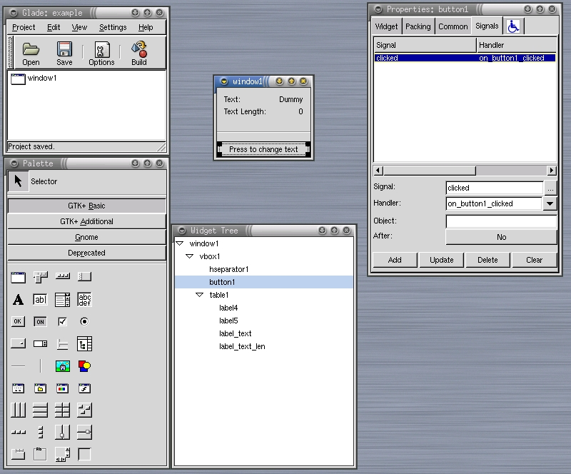

A simple application
********************

This section describes the process of creation of a sample
application, from the design with *Glade*, to the integration of views
and code inside the *MVC-O* Infrastructure.

We want to design and implement a simple application constituted by
only one window, containing two string labels. One label shows a text,
while the other shows the number of characters displayed (i.e. the
length of the string) by the first one. There is also a button the
user can press. By pressing the button, the user can change the
displayed text, and of course this action might change also the
displayed text length accordingly. Figure :ref:`EX:f` gives an idea on
how the application should appear.

.. _EX:f:

   The sample Application

.. _GLEX:

Glade
=====

Figure :ref:`GL:f` shows *Glade* and a project named ``example``.
The sample *GUI* has only one top-level window (named
``window1``).

.. _GL:f:

   Designing the example by means of *Glade* for GTK2

The *Widget Tree Window* shows the widgets hierarchy. There are
essentially the three main components (one button and two labels),
grouped inside a set of *containers*, which supplies alignments and
resizing capabilities.

On the right side of Figure :ref:`GL:f`, the *Properties Window*
shows that the widget named ``button1`` has signal
``clicked`` associated with function
``on_button1_clicked``. This means that the Controller will
have to supply this function in order to handle the ``click``
event occurring in ``button1``.

Implementation
==============

The implementation is slightly elaborate for this example, because the
goal here is to show how the sample application can be implemented by
using the *MVC-O* Infrastructure.

A basic knowledge of any Object Oriented programming language is
sufficient to understand how this example has been pushed inside the
*MVC-O* framework. On the contrary, a fair knowledge of the Python
language is required in order to understand the code details.

More description section is :doc:`impl`.

Model
-----

Class ``ExampleModel`` is as simple as class
``ExampleView``.  As for ``ExampleView``, it extends a
base class of the *MVC-O* Infrastructure, class ``Model``.  The
state is represented by a set of possible messages, as well as by the
current message index. The current message index is also an
observable property. A couple of methods are supplied in order to
access the state. ::

 # file model.py
 from gtkmvc3 import Model

 class ExampleModel (Model):
    """The model contains a set of messages
    and an observable property that represent the current message
    index"""

    # Observable property: code for that is automatically generated
    # by metaclass constructor. The controller will be the observer
    # for this property
    message_index = -1   # -1 is the initial value
    __observables__ = ("message_index",)

    def __init__(self):
        Model.__init__(self)

        self.messages= ("I am patient with stupidity",
                        "but not with those",
                        "who are proud of it.",
                        "(Edith Sitwell)",
                        )
        return

    def get_message(self, index): return self.messages[index]

    def set_next_message(self):
        # this changes the observable property:
        self.message_index = (self.message_index + 1) % len(self.messages)
        return

    pass # end of class

Notice that class instance members are declared to be observable
through the special class variable ``__observables__``,
which is a list of names (string) of the properties that are
observable.

The base class Model belongs to a
meta-class which automatically searches for observable properties and
generates the needed code to handle the notification.  When the value
of variable ``message_index`` changes, all registered
observers will be notified.

View
----

In the example, the View is implemented inside the class
``ExampleView`` shown below. ::

 # file view.py
 import os.path
 from gtkmvc3 import View

 GLADE_PATH = "./"

 class ExampleView (View):
    """The application view. Contains only the main window1 tree."""
    builder = os.path.join(GLADE_PATH, "example.glade")
    top = "window1"

    def set_msg(self, msg):
       self['label_text'].set_text(msg)
       self['label_text_len'].set_text(str(len(msg)))
       return

    pass # end of class

Class ``ExampleView`` extends the generic ``View``
class, which performs most of the job, as described above.
Class members ``builder`` and ``top`` are used instead of
calling ``View`` constructor directly.

Controller
----------

Class ``ExampleController`` contains the *GUI logic* of the
application. The controller handles two signals and the observable
property notification. Signals are the ``destroy`` event,
invoked when the application quits, and the
``on_button1_clicked``, fired when ``button1`` is
pressed. ::

 # file ctrl.py
 from gtk import main_quit
 from gtkmvc3 import Controller

 class ExampleController(Controller):
    """The only one controller. Handles the button clicked signal, and
    notifications about one observable property."""

    def register_view(self, view):
        # Connects the exiting signal:
        view.get_top_widget().connect("destroy", main_quit)
        return

    # Signal
    def on_button1_clicked(self, button):
        """Handles the signal clicked for button1. Changes the model."""
        self.model.set_next_message()
        return

    # Observables notifications
    @Controller.observe("message_index", assign=True)
    def value_change(self, model, name, info):
        """The model is changed and the view must be updated"""
        msg = self.model.get_message(info.new)

        self.view.set_msg(msg)
        return

    pass # end of class

The ``destroy`` signal is connected when the View registers itself
inside the controller, by using the method override of
``register_view``.  Method ``on_button1_clicked`` calls a method
inside the model which changes a part of the state inside the
model. Since that part of the state is an observable property, the
associated observer (which is the controller itself) is notified of
the modification, by calling method ``value_change``. This method
updates the view connected to the controller.

The Launcher (main)
-------------------

The :func:`main` code creates a `(m,v,c)` triple and launches
:func:`gtk.main()`. All the rest is cosmetics. ::

 import gtk

 from model import ExampleModel
 from ctrl import ExampleController
 from view import ExampleView
 import gtkmvc3

 def check_requirements():
    gtkmvc3.require("1.0.0")
    return

 def setup_env(development_state=False):
    # This is how developers should set gtkmvc3 logging level (by
    # default debugging info is not shown):
    if development_state:
        import logging
        logging.getLogger("gtkmvc3").setLevel(logging.DEBUG)
        pass
    return

 def main():
    m = ExampleModel()
    v = ExampleView()
    c = ExampleController(m, v)

    gtk.main()
    return

 if __name__ == "__main__":
    check_requirements()
    setup_env(development_state=True)
    main()
    pass

