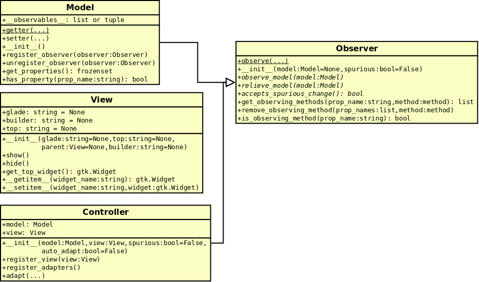
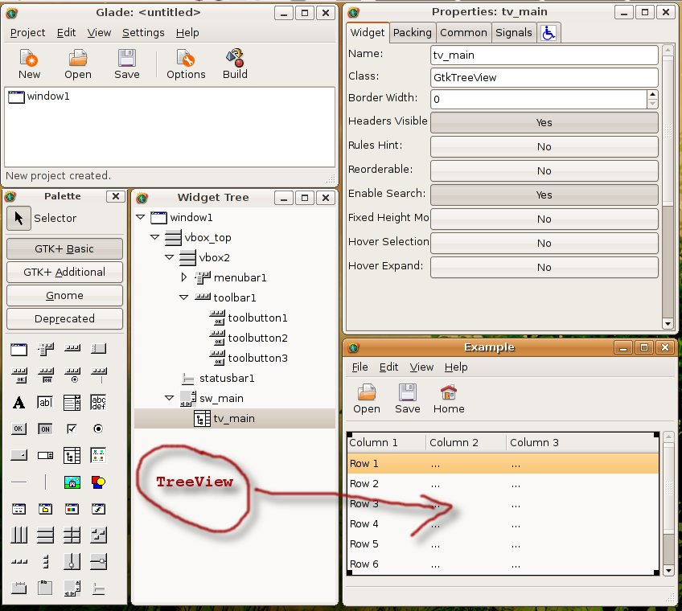

Details of implementation
=========================

This section presents some details regarding the implementation of the
*MVC-O* framework in Python.

Models, Views and Controllers in detail
---------------------------------------

The *MVC-O* framework essentially supplies three base classes which
implement respectively a View, a Model and a Controller. Developers
have to derive custom classes from the base classes set, adding the
implementation which depends on the application semantics.

**Model base class**
   Supplies servicing for:

   * Fully automatic Observable Properties 

   * Automatic broadcast notification when observable properties
     change.

   * Transparent notifications to observers running in the *PyGTK*
     loop, even when sent by models running from other threads.

**View base class**
   Supplies servicing for:

   * Automatic widgets tree registration. Input can be a set of
     root widgets stored inside a *GtkBuilder* file, or inside a
     *Glade* file, or a completely customized widgets hierarchies.
   * Automatic signals connection to methods supplied by the
     associated Controller(s).
   * Widget retrieval inside the set of hierarchy. Widget can be
     accessed by using the name they have been defined from within
     *GtkBuilder* or Glade*, at design time, or that have been
     specified when creating widgets by hand.
   * Support for custom widgets.

**Controller base class**
   Supplies servicing for:

   * Automatic registration as observers of the associated Model.
   * Easy access to the associated Model and View for any derived
     class.
   * Construction of columns and renderers of
     :class:`gtk.TreeView` widgets.
   * Instantiation of :ref:`Adapters`.

The :ref:`fig:ClassDiagram` gives an overview about a few of the main
classes which are discussed in this section, and shows relationships
among them. All details can be found in the API Library Reference, and
of course in the source code.

.. _fig:ClassDiagram:

   Diagram of some of the main classes

.. _MODELS:

Models
------

Models must be used to hold the *data* or *logic* of the
application. They can be connected to observers (like Controllers) by
a mechanism detailed by section :ref:`OP_top`.  It is important to note
that apart from during the registration phase, the model does not know
that there exists a set observers connected to it.

All the code strictly related to the data of the application (i.e. not
related to any view of those data) will live in the model class. 

There exist several model classes that users can derive their own
classes:

gtkmvc.Model
   Standard model class. The derived class does not
   multiple-derive from gobject classes, and there are not methods in
   the class that run from threads different from the *PyGTK* main loop
   thread. This is the base model class most likely users will derive
   their own models.
 
gtkmvc.ModelMT
   Multi-threading model used as the previous
   class Model, but to be used in all cases when the *PyGTK* main loop
   runs in a thread that is different from the thread running the
   model. This is the typical case of a model that needs to perform
   asynchronous operations that requires much time to complete, and
   that can be ran on a different thread making the *GUI* still
   responsive to the user actions. When the model's thread changes an
   observable property, corresponding notifications will be
   transparently delivered to the observers through their own thread.
 
gtkmvc.TreeStoreModel
   To be used as a base model class that
   derives both from ``Model`` and ``gtk.TreeStore``.
 
gtkmvc.TreeStoreModelMT
   To be used as a base model class that
   derives both from ``ModelMT`` and ``gtk.TreeStore``.
 
gtkmvc.ListStoreModel
   To be used as a base model class that
   derives both from ``Model`` and ``gtk.ListStore``.
 
gtkmvc.ListStoreModelMT
   To be used as a base model class that
   derives both from ``ModelMT`` and ``gtk.ListStore``. 
 
gtkmvc.TextBufferModel
   To be used as a base model class that
   derives both from ``Model`` and ``gtk.TextBuffer``.
 
gtkmvc.TextBufferModelMT
   To be used as a base model class that
   derives both from ``ModelMT`` and ``gtk.TextBuffer``.

.. _CONTROLLERS:

Controllers
-----------

User's controllers must derive from this class. A controller is
always associated with one model, that the controller can
monitor and modify. At the other side the controller can control a
View.  Two members called ``model`` and ``view`` hold the
corresponding instances.

The controller holds all the code that lives between data in model and
the data-presentation in the view. For example the controller will
read a property value from the model, and will send that value to the
view, to visualize it.  If the property in the model is an Observable
Property that the Controller is interested in monitoring, than when
somebody will change the property, the controller will be notified and
will update the view.

Model registration
^^^^^^^^^^^^^^^^^^

A controller by default observes the model it is connected
to. However, as :class:`Controller` derives from :class:`Observer`, a
controller can observe multiple models. See :ref:`Observers` for
further information about observers.

Registration occurs automatically. If the observation is not wanted,
the derived controller can call method ``relieve_model`` from the
instance constructor, to unregister itself.

.. _VR:D:

View registration
^^^^^^^^^^^^^^^^^

View registration (see View class, below) occurs upon Controller
construction. An important method of the class Controller that user
can override is ``register_view``, that the Controller will
call during View's registration. This can be used to connect custom
signals to widgets of the view, or to perform some initialization
that can be performed only when model, controller and view are
actually connected.  ``register_view`` gets the view
instance that is performing its registration within the
controller. See section :ref:`VR:EX` for an example of how this
mechanism may be exploited effectively.

Views
-----

User's views derive from base class ``gtkmvc.View``, that is
the only part specific for the *PyGTK* graphic toolkit.

A View is associated to a set of widgets. In general, this set
can be organized as a set of trees of widgets. Each tree can be
optionally be generated by using the *Glade* application 
(see section :ref:`GLEX`). 

Constructor
^^^^^^^^^^^

The View constructor is quite much complicated: ::

 def __init__(self, glade=None, top=None, parent=None, builder=None)

glade
   can be either a string or a list of strings. In any case each
   provided string represents the file name of a *Glade*
   file. Typically each glade file contains a tree of (named)
   widgets.  ``glade`` should be not used anymore in new
   application, and ``builder`` should be used instead (see below).
    
   When not given (of ``None``) a corresponding class member
   called ``glade`` is checked. If also ``self.glade``
   is ``None`` it means that there is no *Glade* file and the
   widgets will have to be constructed manually.
  
top
   can be a string or a list of strings.  Each string
   provided is associated to the parameter ``glade`` content,
   and represent the name of the widget in the widgets tree
   hierarchy to be considered as top level. This lets the user to
   select single parts of the glade trees passed through parameter
   ``glade``.
 
   When not given (of ``None``) a corresponding class member
   called ``top`` is checked. If also ``self.top`` is
   ``None`` it means that the root widget name of the given
   *Glade* file will be taken as the name for the top level widget.

parent
   is the view instance to be considered parent of
   self. This can be used in special cases to construct hiearchical
   views. Generally this parameter is None or not given.

builder
   can be a string, representing the file name of a *GtkBuilder*
   file produced e.g. with *Glade*. ``builder`` is an alternative
   to ``glade`` and should be used instead of it as ``glade`` file
   format is being deprecated.

   When not given (of ``None``) a corresponding class member
   called ``builder`` is checked. If also ``self.builder``
   is ``None`` it means that there is no *GtkBuilder* file and the
   widgets will have to be constructed manually

.. _VIEW:MANUAL:

A widgets container
^^^^^^^^^^^^^^^^^^^

The ``View`` class can also be considered a map, that associates
widget names to the corresponding widget objects. If *GtkBuilder*
file ``test.xml`` contains a Button that you called
``start_button`` from within *Glade*, you can create the view and
use it as follows: ::

 from gtkmvc import View
 
 class MyView (View):
   builder = 'test.glade'
   pass 
 
 m = MyModel()
 v = MyView()
 c = MyController(m, v)
 
 v['start_button'] # this returns a gtk.Button object

Instead of using only *GtkBuilder* or *Glade* files, sometimes the
derived views create a set of widgets on the fly. If these widgets
must be accessed later, they can be associated simply by
(continuing the code above): ::

 v['vbox_widget'] = gtk.VBox()
 ...

The creation on the fly of new widgets should be performed within
the derived view constructor: ::

 from gtkmvc import View
 
 class MyView (View):
   def __init__(self, ):
     View.__init__(self, builder='test.glade')
 
     self['vbox_widget'] = gtk.VBox()
     ...
     return
 
   pass 

Another important mechanism provided by the class View is the signals
auto-connection. By using *Glade* users can associate to widget's
signals functions and methods to be called when associated events
happen. When performs the registration, the View searches inside the
corresponding Controller instance for methods to associate with
signals, and all methods found are automatically connected.

Custom widgets support
^^^^^^^^^^^^^^^^^^^^^^

A basic support for Custom widgets is provided since version 1.0.1.
Designers can specify custom widgets within a *Glade* file, and for
each custom widget they may specify a function name to be called to
build it. The specified function will be searched and invoked among
the ``View`` methods when the instance is
created. ``View``'s method for custom widget creation
has prototype: ::

 def func_name(self, str1, str2, int1, int2)

Creation functions are expected to return a widget object.

.. _VR:EX:

An example about View Registration
^^^^^^^^^^^^^^^^^^^^^^^^^^^^^^^^^^

A typical example of exploitation of the view registration mechanism
is the setup of a ``gtk.TreeView`` chain: construction of
``TreeView``, ``TreeViewColumn``,
``CellRenderers``, connection to the ``TreeModel``, etc.
As *Glade* does not provide a full support for these widgets, and as
the ``TreeModel`` lives in the model-side of the application,
their construction cannot occur within the View, but must be performed
within the Controller, that knows both the view and model sides. The
right time when this construction has to occur is the view
registration.

The idea is to have a ``TreeView`` showing an integer and a
string in two separated columns from a ``gtk.ListStore``.

Now suppose you created a project in *Glade* that contains a window,
some menus and other accessories, and a ``TreeView`` whose
properties are set in *Glade* in a comfortable manner (see figure
:ref:`fig:VR`).

.. _fig:VR:

   Designing a ``TreeView`` by means of *Glade*

In the example, the ``TreeView`` has been called
``tv_main``, and after View creation the widget will be
available with that name. ::

 from gtkmvc import View
 
 class MyView (View):
   def __init__(self):
     View.__init__(self, 'test.glade')
     #...
     return
   pass 

The ``ListStore`` is of course not contained in the view, but
it is created and stored in the Model. If the model had to be also a
``ListStore`` (i.e.  derived from it) ``MyModel`` had to
derive from ``gtkmvc.ListStoreModel`` instead of
``Model``. To keep things easier, Has--A relationship is
chosen. ::

 from gtkmvc import Model
 import gtk
 import gobject
 
 class MyModel (Model):
   def __init__(self):
     Model.__init__(self)
 
     self.list = gtk.ListStore(gobject.TYPE_INT, gobject.TYPE_STRING)
     return
   pass 

The controller has the responsibility of connecting the
``TreeView`` and the ``ListStore``, and it creates
columns and renderers as well. Construction must occur after View has
been created. More precisely, the ideal time is during
view-registration. ::

 from gtkmvc import Controller
 import gtk

 class MyCtrl (Controller):
 
   def register_view(self, view):
     tv = self.view['tv_main']    
     tv.set_model(self.model.list) # sets the model
 
     # creates the columns
     cell = gtk.CellRendererText()
     col = gtk.TreeViewColumn('Int', cell, text=0)
     tv.append_column(col)
 
     cell = gtk.CellRendererText()
     col = gtk.TreeViewColumn('String', cell, text=1)
     tv.append_column(col)
 
     # registers any treeview-related signals...
     return
 
   pass # end of class 

