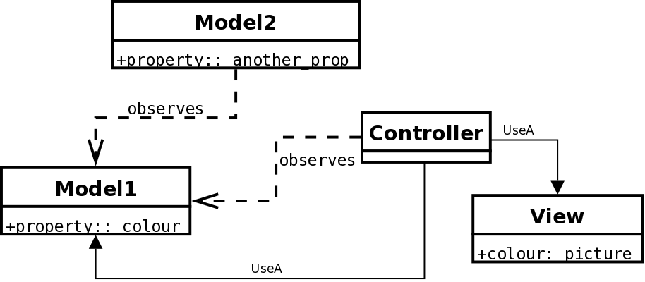

Implementation of the Observer pattern
======================================

A Model does not know that it is connected to a set of controllers,
because this knowledge implies the knowledge of the *GUI* semantics,
which has to be out-of-scope for the Model.

Nevertheless, sometimes it is necessary for a Model to communicate to
the *GUI* logics (generally the Controllers set) that the model state
changed. This communication can be implemented by the *Observer* pattern, that
provides a mechanism where *Observers* are notified when
*observed* state in the model get changed.

Even if models are typically observed by the *GUI* logics, the
mechanism can be used also to decouple (isolate) models and other
entities in the application logics. For example, models can be
observed by other models.

In *gtkmvc3* Models' state has been extended with a mechanism called
*Observable Properties*. An observable property is a part of the
Model state which is also externally observable via an
*Observer*. Every time an observable property changes, any
interested Observer will be notified of the event.

Figure :ref:`F:OBS` shows a Model (*Model1*) containing an
observable property (*color*). There are also a Controller and a
View (to show the colour), and the Controller is also an observer of
*Model1*. Furthermore, there is another Observer that is model
*Model2*, whose state the designer wanted to make dependent on the
state of *Model1*, but without explicitly coupling the two models.

When the property *color* changes for example to red, all connected
Observers will be notified. Each observer will then perform the
necessary operation according to the respective logics. For example,
the Controller will make the connected View showing the occurred
change.

.. _F:OBS:

   Observable models and Observers

Each Observer declares it is interested in receiving notifications on
one or more properties changing, by a mechanism called
*Registration*. Once an Observer (for example, a Controller)
registered itself with the Model it is associated with, it will be
notified of all changes of the observable properties. The Observers
will be notified only of the property changes that they are actually
interested in observing.

Observable properties are then syntactically bounded to
notifications sockets inside Observers.

Later in this document, some implementation details are discussed, and
further details about observable properties are presented. Finally,
an example in the latest part should make all these concepts clearer.

*Adapters* (see section :doc:`adapt` are powerful entities that
can be used to automatically bind part of the view with part of the
model with a minimal effort, without any need to couple with complex
code and naming rules. However, *Adapters* should be used only
after all the "manual" mechanisms have been well understood, and
for this reason they are presented only at the end of this document.

.. _KOBS:

Supported types of Observable Properties
----------------------------------------

Observable properties can hold several types of values:

Any type
   Change notification will occur only when the value is
   *assigned* to the property.

Mutable sequential types
   Like lists and maps. A notification
   will occur when the *content* of the object changes, e.g.
   when one element of the sequence is assigned, added, removed, etc.
 
User classes
   The user can declare the set of methods that can
   be observed (i.e. observables will be notified before and/or after
   observed object *methods* are called.)

Signals
   To notify the observers that some event is occurred.

All needed details about observable property types are explained later
in this document (see section :ref:`OPtypes`).
