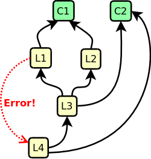

.. _OP_log:

=============================
Logical Observable Properties
=============================

.. versionadded:: 1.99.1

*Logical* OPs are properties whose values are not necessarily
stored in the model, but which are read and written by a pair of
getter/setter methods.

This make logical OPs ideal for:

* Values calculated out of other OPs (which can be either logical
  or concrete).
* Values living outside the model, like e.g. in a database, or in a
  remote server.

Logical OPs are declared like concrete OPs, but no correspoding
attributes have to appear in the class. Their name have to appear
only within the special member ``__observables__``. 
For example: ::

 from gtkmvc import Model
 # ----------------------------
 class MyModel (Model):
    name = "Roberto" 
    
    __observables__ = ("name", "happiness")
    pass # end of class
 # ----------------------------

In the example, ``name`` is a concrete property, whereas
``happiness`` is a logical property, as no corresponding attribute
exists in class ``MyModel``.

.. Note:: 
   Notice that names of logical OPs occurring within the
   special member ``__observables__`` cannot contain wildcards like
   concrete properties.

   The reasons for this limitation is obvious, as wildcards
   can be used to match only class attributes.)

However, a logical OP's value is taken from a getter method, and
for a read/write OP the values are stored through a setter
method. Defining a getter is mandatory, while defining a setter is
required only for writable logical OPs.

getter/setter methods can be defined by exploiting decorators, or
by exploiting a naming convention.

Use of decorators for defining getters and/or setters
-----------------------------------------------------

Decorators ``@Model.getter`` and ``@Model.setter`` can be used for
defining logical OPs getter and setter respectively. The syntax and
semantics are very similar to the python ``@property`` 
decorator. 

E.g. for logical OP ``happiness`` in the previous example: ::

 from gtkmvc import Model
 # ----------------------------
 class MyModel (Model):
    name = "Roberto" 
   
    __observables__ = ("name", "happiness")

    _a_value = 1.0 # support for happiness
    @Model.getter
    def happiness(self): return self._a_value

    @Model.setter
    def happiness(self, value): self._a_value = max(1.0, value)

    pass # end of class
 # ----------------------------

It is possible to define getter/setter methods which serve multiple
logical OPs.
For example: ::

 from gtkmvc import Model
 # ----------------------------
 class MyModel (Model):
    name = "Roberto" 
   
    __observables__ = ("name", "happiness", "energy")

    _a_value = 1.0 # support for happiness
    @Model.getter("happiness", "energy")
    def a_getter_for_several_ops(self, name): 
      if "energy" == name: return 0.1 # constantly need holidays!
      return self._a_value

    @Model.setter
    def happiness(self, value): self._a_value = max(1.0, value)

    pass # end of class
 # ----------------------------

In the example, the decorator ``@Model.getter`` is used with
arguments, which have to be the string names of all properties
which have to be handled by the decorated method. The method (the
getter in this case) will receive the name of the property along
with its other arguments.

Use of wildcards is allowed in decorators names, and will match all
logical OPs not exactly matched by other decorators. It is an error
condition if multiple matches are found when matching logical OPs
specified with wildcards. For example this is perfectly legal: ::

 from gtkmvc import Model
 # ----------------------------
 class MyModel (Model):
    name = "Roberto" 
    
    __observables__ = ("name", "energy", "entropy", "enology")

    @Model.getter
    def energy(self): return 0.1  # constantly need holidays!

    @Model.getter("enology")
    def getter1(self, name): return "good science!"

    @Model.getter("en*") # matches only remaining 'entropy'
    def getter2(self, name): 
      assert "entropy" == name
      return 0
    
    @Model.setter("*") # matches "energy", "entropy", "enology"
    def happiness(self, name, value): 
        print "setter for", name, value
        ...
        return

    pass # end of class
 # ----------------------------

However, this example is not legal: ::

 from gtkmvc import Model
 # ----------------------------
 class MyModel (Model):
    
    __observables__ = ("energy", "entropy", "enology")

    @Model.getter("en*") # matches energy, entropy, and enology
    def getter1(self, name): ...

    @Model.getter("*") # matches energy, entropy, and enology
    def getter2(self, name): ...

    pass # end of class
 # ----------------------------

The example does not work as ambiguity is found when resolving
wilcards.

Use of naming convention for defining getters and/or setters
------------------------------------------------------------

In some cases, the use of decorators for defining getters/setters
can be a limitation. For example, when the model is built
dynamically, like when generating proxy classes.

In these and other cases, the framework supports a *naming
convention* which can be used to define implicitly getters and/or
setters for logical OPs. 

The naming convention applies to Model's method names which are
implicitly declared as getters or setters.

* `get_<prop_name>_value(self)`: A specific getter for OP `<prop_name>`.
* `set_<prop_name>_value(self, value)`: A specific setter for OP `<prop_name>`.
* `get__value(self, name)`: A generic getter receiving the name of
  the property to be get.
* `set__value(self, name, value)`: A generic setter receiving the name of
  the property to be set.

As you see getters/setters can be either *specific* or
*generic*. In the former case, the getter/setter is specific for
one OP. In the latter case, getter/setter is general and will
receive the name of the property.

Generic getter/setter will not be called for OPs which have
specific getter/setter defined. For example: ::
 
 from gtkmvc import Model
 # ----------------------------
 class MyModel (Model):
    __observables__ = ("energy", "entropy", "enology")

    def get_energy_value(self): return 0.1  # constantly need holidays!

    # getter for entropy and enology only, as energy has a specific getter
    def get__value(self, name): ...

    # setter for all properties
    def set_value(self, name, value): ...

    pass # end of class
 # ----------------------------

The first example we presented for decorators could be rewritten
as: ::

 from gtkmvc import Model
 # ----------------------------
 class MyModel (Model):
    name = "Roberto" 
    
    __observables__ = ("name", "energy", "entropy", "enology")

    def get_energy_value(self): return 0.1  # constantly need holidays!

    def get_enology_value(self): return "good science!"

    def get__value(self, name): 
      assert "entropy" == name
      return 0
    
    def set__value(self, name, value): 
        print "setter for", name, value
        ...
        return

    pass # end of class
 # ----------------------------

Of course, since in naming conventions names *matters*, some names
in the example had to be adapted.

.. _OP_log_deps:

Dependencies among OPs
----------------------

.. versionadded:: 1.99.2

If the value of a logical OP `p` is calculated out of other OPs, `p`
*depends* on the other OPs. In the general case, logical OPs depend on
other OPs which can be both logical and concrete. Of course mutual
dependencies are not allowed as otherwise there would be an infinite
loop among them.

For example, a model may contain the absolute temperature (expressed
in kelvin) as concrete OP, and may have two logical OPs for
representing the temperature expressed in "celsius" and "fahrenheit",
whose value can be calculated out of the absolute temperature in
kelvin::

 from gtkmvc import Model
 class TemperatureModel (Model):
   kelvin = 273.15
   
   __observables__ = ("kelvin", "celsius", "fahrenheit",)
   
   @Model.getter(deps=["kelvin"])
   def celsius(self): return self.kelvin - 273.15

   @Model.getter(deps=["kelvin"])
   def fahrenheit(self): return self.kelvin * 9/5.0 - 459.67

   # This could also be equivalently:
   #@Model.getter(deps=["celsius"])
   #def fahrenheit(self): return self.celsius * 9/5.0 + 32

Now if the temperature (`kelvin`) gets changed, logical values
`celsius` and `fahrenheit` would change accordingly, as they are
calculated out of the former. 

However, what happens to the observers? Dependencies among OPs must be
propagated to the notifications for the observers. In the example,
changing `kelvin` should raise a notification to the observers of
`kelvin` OP, but **also** to the observers of `celsius` and
`fahrenheit` as they values have been (indirectly) changed as well.
 
The framework takes care of handling correctly the notifications, if
dependencies are specified by the user. Dependencies are declared via
the keyword argument `deps`:

* In the `getter` decorator when using decorator for defining a
  logical getter.
* In the getter method when using the naming convention for defining
  the logical getter.

In both cases the argument `deps` must be assigned to an `iterable` of
strings, representing the list of OPs which the logical OP depends on.

In the following example, there are two concrete OPs (`C1` and `C2`)
and four logical OPs (`L1`, ...,`L4`) whose dependency relations are
depicted in the figure.

.. _OP_deps_fig:

   An example of dependencies among OPs

The model may be::

 from gtkmvc import Model
 class MyModel (Model):
   C1 = 1
   C2 = 2

   __observables__ = "C1 C2 L1 L2 L3 L4".split()
   
   @Model.getter("L1", "L2", deps=["C1"]) # deps=["C1", "L4"] is an error!
   def getter_L1L2(self, name):
      return { "L1": self.C1 + 1,
               "L2": self.C1 + 2 }[name]

   @Model.getter(deps=["L1", "L2", "C2"])
   def L3(self):
      return self.L1 + self.L2 + self.C2

   @Model.getter(deps=["L1", "L2", "C2"])
   def L3(self):
      return self.L1 + self.L2 + self.C2

   def get_L4_value(self, deps=["L3", "C2"]):
      return self.L3 + self.C2

Notice that:

1. When defining the dependencies of an OP, we specify only the
   neighbors in the dependencies graph, not the whole
   dependencies. For example for `L4`, dependencies are `(L3, C2)`,
   and not `(L3, L1, L2, C1, C2)`, as the framework takes care of
   resolving all the graph dependencies.

2. Circular dependencies are not allowed (depicted with a red array).

3. Spurious dependencies are correctly handled by the framework. For
   example when `C2` changes, only one notification for `L4` is sent
   to the observers, even if `L4` depends on `C2` through two paths
   (directly and through `L3`).

4. We defined the getter of `L4` by using the naming convention
   `get_<prop_name>_value`. In this case (and for the general
   `get__value`) to define dependencies it is needed to add a
   parameter `deps` whose default value is an iterable containing the
   dependencies names.

   
