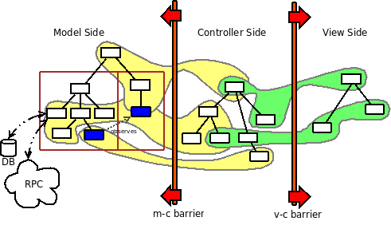
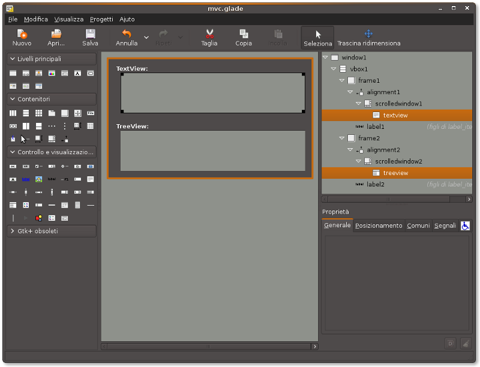
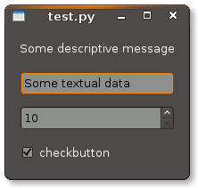

.. pygtkmvc documentation master file, created by sphinx-quickstart on Mon Mar 23 18:58:19 2009.
   You can adapt this file completely to your liking, but it should at least
   contain the root `toctree` directive.

====================
gtkmvc in 45 minutes
====================

This document presents gtkmvc for those who are in hurry, or for
curious people who want to have a quick overview of gtkmvc features
and capabilities.

.. warning:: 
 This document is not exhaustive, as many important details are not
 described. For a complete information refer to the User Manual and to
 the Tutorial, both coming along with gtkmvc.

 It is assumed you already know *Python*, *pygtk* and have some
 experience with *design issues*. 
 However, here you will find a short introduction
 presenting the main actors that are going to play a role into an
 GUI application based on gtkmvc. 

------------
Introduction
------------

What is gtkmvc, and what it does
~~~~~~~~~~~~~~~~~~~~~~~~~~~~~~~~

gtkmvc is a thin framework for developing GUI applications with
Python and the pygtk toolkit.

1. It helps you to organize the source code of your application.
2. It provides some support for making views out of glade files.
3. It separates the data/logic of your application (the *model*) from the presentation layer (the *view*).
4. It tries to be as much transparent as possible wrt your application. 

Some terminology
~~~~~~~~~~~~~~~~

**Model**
        Contains the logic of the application, the data that are
        independent on the GUI.
        For example, in a *music player*:

        * The list of the mp3 file names.
        * The methods for playing the files in the list.
        * The methods for contacting a server in the Internet for
          downloading some new music file.

**Observer**
        It is an entity interested in observing some parts of one or
        more Models. Observers are used to react to certain changes in
        models without creating explicit dependencies or links with them.

**Observable Property**
        It is an attribute of the Model, that is supposed to be
        *observable* by one or more observers connected to the model.
        For example:

        * The property ``current_mp3_file`` that is the currently
          played mp3 file name.
        * The property ``current_perc`` holding the % of the mp3 file
          that is being played.

**View**
        Contains a set of widgets, and the methods for
        manipulating them. The set of widgets can be build out of a
        *glade* file. E.g:

        * A method for making a bunch of widgets visible/invisible
        * A method for making the view appearing in same manner under
          some circumstances.

**Controller**
        It is a particular kind of observer, connected to one model
        and to one or more views. It contains the GUI logic, and all
        handlers for GUI signals. E.g.

        * A method for making the model play selected file when the
          ``play`` button is clicked.
        * The code that makes a progress bar advance in the view
          as the music file is played by the model. 

**Adapter**
        Adapts the content of one widget (or a set of widgets) into
        the view with one observable property into the model. An
        adapter keeps the content of an observable property
        up-to-dated with the content of a widget, and
        viceversa. Adapters live into the controllers. 
        E.g.

        * An adapter that bounds property ``current_perc`` with a
          progress bar widget into the view.

.. note:: 
 All these entities are now presented more in details.   

What is all this complexity for?
~~~~~~~~~~~~~~~~~~~~~~~~~~~~~~~~
The final goal is to get your life as a designer/programmer. Designing
a complex GUI is an easy task only in principle. In fact it is hard to
decouple logic and presentation layers, and even harder to separate
control code that *should* be separate. And in the end, it is easy to get
spaghetti code especially in the control flow part of the GUI.

Even if gtkmvc tries to stay behind the scene, it imposes structure
and barriers to the application that may be perceived as complex
artifacts to beginners. However the application can grow up with a
good structure that allows for clean control and data flows.

In the picture you can see how a middle/large GUI application can be
organized and decomposed with gtkmvc.

Spend some time looking at this funny image. On the left, models
designed as a pair of separate hierarchies. One of the model in the
left hierarchy observes one model into the other hierarchy.

On the right, the presentation layer is designed as a hierarchy of
three views. Each view can be based on one glade file that can be
shared among views. 

The model and the view sides do not see each other as they are
separated by the two depicted barriers. Those barriers avoid the model
to be involved in the presentation layer, and the view to be tempted
to access the model part.

In the middle, the control part live. The controllers within it can
see through the barriers. Controllers observe some parts of the logic
into the model side, and can control some parts of the views.

1. One controller controls one view (and possibly the sub-views)
2. One view can be controller by one or more controllers.
3. One controller control and observes one model.
4. One controller can also observe many other models.
5. One model can be observed by many observers.

The picture shows how a GUI can be decomposed. Keep in mind that
decomposition is always intended to couple with (and hopefully reduce)
complexity.

For example, you can have a controller controlling the menu and the
toolbar of the application, a controller for one sub-view, two
controllers for another sub-view, etc. Each controller is connected to
one model, which is a part of the application logic. 

-----
Views
-----

A view is a class that is intended to be a container for widgets. ::

 import gtk
 from gtkmvc import View

 class MyView (View):
    glade = "view_glade_file.glade"
    top = "name_of_top_level_widget"

    def __init__(self):
        View.__init__(self)
        
        # possible construction of manual widgets
        self['name_of_new_label'] = gtk.Label("A label manually constructed!")
        self['some_container_in_glade_file'].pack_start(self['name_of_new_label'])

        # possible setup of all widgets
        # ...
        return

    def set_sensitivity(self, flag):
        for wid in (self[x] for x in ('widget1', 'widget2', )):
            wid.set_sensitive(flag)
            pass
        return

    pass # end of class

Your view is derived from base class ``gtkmvc.View`` that offers
several services:

1. Attributes ``glade`` that is used to tell the view which glade file
   its widgets are taken from.
2. Attributes ``top`` that is used to tell which is the widget name in
   the glade file tree to be taken as the root widget. It is also
   possible to specify a list of names to pick a set of trees.
3. The view instance can be used a container (a dictionary) of
   widgets, both for accessing named widgets in glade files, and for
   creating new widgets manually.

Views can be decomposed into a hierarchy of views. For example::

 import gtk
 from gtkmvc import View

 class MySuperView (View):
    glade = "view1.glade"
    top = "view1_top_widget"

    def __init__(self):
        View.__init__(self)

        self.subview = MySubView()

        # connects the subview to a widget in the containing view
        self['some_container'].add(self.subview.get_top_widget())
        return
    pass # end of class
 
 class MySubView (View):
    def __init__(self):
        View.__init__(self, glade="view2.glade", top="view2_top_widget")
        # setting of sub view...
        return
    pass # end of class

As you can see:

1. It is possible to construct a hierarchy of views to deal with view
   composition.
2. Subviews  can be connected to known containers widgets into the
   containing view, like in the example.
3. Class View provides the method ``get_top_widget`` that returns the
   View's top level widget.
4. Both attributes ``glade`` and ``top`` can be overridden or
   substituted by View's constructor equivalent parameters. 

For simple cases (views offering no services, and only based on a
glade file) it is not mandatory to derive our own class::

 from gtkmvc import View
 v = View(glade="myview.glade", top="mytop_widget)

------
Models
------

A model is a class that is intended to contain the application's
logic. A model contains data and methods, and a subset of the data can be
declared to be *observable*. ::

 from gtkmvc import Model
 class MyModel (Model):
    data1 = 10
    data2 = "a string"
    data3 = "a list of strings".split()

    __observables__ = ("data1", "data3")

    pass # end of class

A model must derive from ``gtkmvc.Model`` [#fn1]_ which derives from
``Observer`` as models may be interested in observing themselves and
other models (see *Observers* below).

*Observable Properties* are declared through the special attribute
``__observables__`` which is a sequence of string names.

In the example class attributes ``data1`` and ``data3`` are declared
to be observable properties. Names in ``__observables__`` can contain
wildcards [#fn2]_ and all attributes in the class not beginning with a
double underscore ``__`` will be checked for matching. For example
``__observables__ = ("data?",)`` would match ``data1``, ``data2`` and
``data3``.

Observable Properties
~~~~~~~~~~~~~~~~~~~~~

Observable properties live into models and can be assigned to several
types of values, included lists, maps, and user defined classes.  For
all details about the observable properties, see the User Manual for
the details.

1. Value Properties
"""""""""""""""""""
*Value Properties* are intended to hold values which when are
*re-assigned* observers are notified. ::

 from gtkmvc import Model
 class MyModel (Model):
    data1 = 5
    data2 = [1,2,3]
    data3 = {}
    data4 = SomeClass()
    __observables__ = ("data?", )
    pass # end of class

 m = MyModel()
 # here the properties are re-assigned
 m.data1 += 15  
 m.data2 = [4,5,6]
 m.data3 = { "key" : "value" }
 m.data4 = SomeOtherClass() 

Every time a value property gets reassigned, observers observing it
will be notified.

2. Custom Value Properties
""""""""""""""""""""""""""
Sometimes it is needed to store values of properties *outside* the
model, like in the File System, in a DB, or somewhere in the network
via RPC. In this case it is possible to declare observable
properties that do not correspond to any class attribute, but that
correspond each to a pair of methods (getter/setter)::

 from gtkmvc import Model
 class MyModel (Model):
    data1 = 5
    __observables__ = ("data1", "data_external")

    def get_data_external_value(self):
    	value = # get the value somehow
	return value

    def set_data_external_value(self, value):
    	# store the value somehow...
	return

    pass # end of class

A getter/setter pair has to follow a *naming convention*, and in the
example is given for the **specific** property ``data_external``.

It is also possible to define **one generic** getter/setter pair that
takes also the name of the custom property::

 from gtkmvc import Model
 class MyModel (Model):
    data1 = 5
    __observables__ = ("data1", "data2", "data3", "data4")

    # this handles data3 and data4
    def get__value(self, prop_name):
    	if prop_name == "data3": value = # get the value of data3 somehow
	elif #... 
	return value

    # this handles data3 and data4
    def set__value(self, prop_name, value):
    	if prop_name == "data3": # store the value of data3 somehow
	elif #... 
	return   
    
    def get_data2_value(self):
    	value = # get the value somehow
	return value

    def set_data2_value(self, value):
    	# store the value somehow...
	return

    pass # end of class

.. note:: Specific getter/setter pair shadows the generic pair for the
 property they handle. In the example, ``get__value`` and
 `set__value`` will be never called for property ``data2``.

.. note:: You can exploit custom properties values to perform some
 custom actions when a property is read or written.

3. Mutable containers
"""""""""""""""""""""
When the value of an observable property is a mutable object, like a
sequence or a map, observers may be interested in being notified when
a method is called on the object itself::

 # here the object contents are changed:
 m.data2.append(7)
 m.data3['key2'] = "value for key2"
 

4. Mutable class instances
""""""""""""""""""""""""""
Properties can be instances of mutable classes. Like for containers
objects, observers may be interested in being notified when a method
changing the object is called::

 # here the object contents are changed:
 m.data4.some_method_changing_the_instance()

Of course it is needed to declare method
``SomeOtherClass.some_method_changing_the_instance`` to be
observable. For example::

 from gtkmvc.model import Model, Observable
 class SomeOtherClass (Observable):
    """This is a class that is thought to be integrated into the
    observer pattern. It is declared to be 'observable' and the
    methods which we are interested in monitoring are decorated
    accordingly"""

    val = 0

    @Observable.observed # this way the method is declared as 'observed'
    def change(self): self.val += 1

    pass #end of class

Observable properties derive from class ``Observable`` and methods
that change the content of the instance can be declared by using the
``Observable.observed`` decorator like in the example. 

Ok, but what if my class is already existing? It is less natural, but
gtkmvc supports observable properties of already existing classes'
instances::

 from gtkmvc import Model, Observer

 class ExistingClass (object):
    """This is an already existing class whose code is not intended to
    be changed. Instead, when instantiated into the model, it is
    declared in a particular manner, so that the model can recognise
    it and wrap it in order to monitor it"""
    
    val = 0 

    def change(self): self.val += 1
    pass #end of class

 class MyModel (Model):

    obj = (ExistingClass, ExistingClass(), ('change',))
    __observables__ = ["obj"]

    pass # end of class

The triplet must contain the name of the class, the instance, and a
list naming the methods whose calls can be observed by observers. 

5. Signals
""""""""""
Sometimes the models want to communicate to observers that *events*
occurred. For this ``Signal`` can be used as property value::

 from gtkmvc import Model, observable
 class MyModel (Model):
    sgn = observable.Signal()
    __observables__ = ("sgn",)
    pass

 m = MyModel()
 m.sgn.emit()
 m.sgn.emit("A value can also be passed here")

---------
Observers
---------

An observer is a class that is interested in being notified when some
observable properties into one or models it observes gets changed.

Methods in the observer that are intended to receive notifications can
be defined through:

1. An implicit *naming convention* for single properties.
2. An explicit declaration that exploits decorators, for single and
   multiple properties.

Depending on the type of the observable property, you can see three
different types of notifications:

1. Value change notifications (for value assignments)
2. Method calls (for containers and class instances)
3. Signal emitting (for signals)

In the example you find value, before call, after call and signal
notifications, presented in both flavours explicit and implicit::

 from gtkmvc import Observer

 class MyObserver (Observer):

    # ------------------------------------------------------
    #    Value change
    # ------------------------------------------------------   
    @Observer.observes("data1", "data2")
    def my_observing_value_method(self, model, prop_name, old, new):
    	print "Explicit value observer:", prop_name, old, new
 
    def property_data1_value_change(self, model, old, new):
        print "Implicit value observer for data1:", old, new
        return
   
    # ------------------------------------------------------
    #    Before method call
    # ------------------------------------------------------   
    @Observer.observes("data3",)
    def my_observing_before_call_method(self, model, prop_name, instance, name, args, kwargs):
    	print "Explicit before call observer:", prop_name, instance, name
        return
	
    def property_data3_before_change(self, model, instance, name, args, kwargs):
        print "Implicit data3 before call observer", instance, name
        return

    # ------------------------------------------------------
    #    After method call
    # ------------------------------------------------------   
    @Observer.observes("data3",)
    def my_observing_after_call_method(self, model, prop_name, instance, name, res, args, kwargs):
    	print "Explicit after call observer:", prop_name, instance, name, res
        return
		
    def property_data3_after_change(self, model, instance, name, res, args, kwargs):
        print "Implicit data3 after call observer", instance, name, res
        return

    # ------------------------------------------------------
    #    Signal emitted 
    # ------------------------------------------------------   
    @Observer.observes("sgn",)	
    def property_sgn_signal_emit(self, model, signal_name, arg):
    	print "Explicit signal observer", signal_name, arg
	return

    def property_sgn_signal_emit(self, model, arg):
    	print "Implicit signal observer of sgn", arg
	return
	
    pass # end of class

.. note:: You may use explicit observing methods for processing
          multiple properties notifications at once, and implicit
          observing methods for single properties. However, there is
          no a strict rule for using either one or the other.

Here is how the model and our observer can be connected/unconnected::

 m = MyModel()
 o = MyObserver()
 o.observe_model(m)
 # ...
 o.relieve_model(m)

``Observer`` constructor optionally takes a model that it registers
into::

 m = MyModel()
 o = MyObserver(m)
 # ...
 o.relieve_model(m)

Now let's try to modify the assigned value to a property::
 
 from gtkmvc import Model
 class MyModel (Model):
    data1 = 10
    data2 = "a string"
    data3 = "gtkmvc makes your life easier".split()
    __observables__ = ("data?", )
    pass # end of class

 m = MyModel()
 o = MyObserver(m)

 m.data1 += 1
 print ">>> Here m.data is", m.data1

 m.data2 = "Another string"
 m.data3.append("and fun")
 m.data3[0] = "music"
 
The execution of this example produces the following output::

 Implicit value observer for data1: 10 11
 Explicit value observer: data1 10 11
 >>> Here m.data is 11
 Explicit value observer: data2 a string Another string
 Implicit data3 before call observer ['gtkmvc', 'makes', 'your', 'life', 'easier'] append
 Explicit before call observer: data3 ['gtkmvc', 'makes', 'your', 'life', 'easier'] append
 Implicit data3 after call observer ['gtkmvc', 'makes', 'your', 'life', 'easier', 'and fun'] append None
 Explicit after call observer: data3 ['gtkmvc', 'makes', 'your', 'life', 'easier', 'and fun'] append None
 Implicit data3 before call observer ['gtkmvc', 'makes', 'your', 'life', 'easier', 'and fun'] __setitem__
 Explicit before call observer: data3 ['gtkmvc', 'makes', 'your', 'life', 'easier', 'and fun'] __setitem__
 Implicit data3 after call observer ['music', 'makes', 'your', 'life', 'easier', 'and fun'] __setitem__ None
 Explicit after call observer: data3 ['music', 'makes', 'your', 'life', 'easier', 'and fun'] __setitem__ None

Of course an observer is not limited to observe one model::

 m1 = MyModel()
 o = MyObserver(m1) # o observes m1
 m2 = AnotherModel()
 o.observe_model(m2) # o observes also m2 now

It is usual to see models observing other models, like siblings or
sub-models in model hierarchies. For this reason class ``Model``
derives from class ``Observer``::

 m3 = AnotherModel()
 m3.observe_model(m2) # m3 observes m2

-----------
Controllers
-----------

Controllers are the most complex structures that are intended to:

1. Contain the GUI logic.
2. Connect one model and one or more views, without making them know.
3. Observe the model they are connected to.
4. Provide handlers for gtk signals (declared in the views connected to it)
5. Setting up widgets that depend on the model. For example setting up
   of ``gtk.TreeView`` whose ``gtk.TreeModel`` lives within the model
   (see :ref:`gtk.TreeView`)
6. Setting up :ref:`adapters`

This is the typical structure of a controller::

 from gtkmvc import Controller

 class MyController (Controller):

       def __init__(self, model, view):
       	   Controller.__init__(self, model, view)

	   # From here on the connected model and view are accessible
	   # through fields 'self.model' and 'self.view' respectively.
	   
	   # setup internal fields...

	   # setup sub-controllers...
	   
	   return

       def register_view(self, view):
       	   # initializes the view if needed
       
           # setup widgets that need a model, like TreeView (see next section)...
           
	   # setup widgets not specified in glade, like TreeViewColumn...
	   
       	   # connect additional signals (e.g. for manually constructed widgets...
		    
       	   return

       def register_adapters(self):
       	   # setup all adapters (see Adapters below)
       	   return

       # ------------------------------------------------------------
       #      GTK Signal handlers
       # ------------------------------------------------------------
       def on_button_clicked(self, button):
       	   # ...
	   return

       # ...

       # ------------------------------------------------------------
       #      Notifications of observable properties
       # ------------------------------------------------------------
       def property_prop_name_value_change(self, model, old, new):
       	   #...
	   return
	   
       pass # end of class

As you see, a controller does a lot of work, and tends to blow-up in
size. For this reason it is important to split big controllers into
sub-controllers. Ina typical configuration, the application model is
split into sub-modules, say *m1*, *m2* and *m3*.
The application controller is split into several sub-controllers, and
there are sub controllers *c1*, *c2* and *c3* respectively controlling
just *m1*, *m2* and *m3*. ::

 # file model.py
 from gtkmvc import Model
 class ApplModel (Model):
   # observable properties...

   def __init__(self):
       Model.__init__(self)

       # sub-models:
       self.m1 = MyModel1(self)
       self.m2 = MyModel2(self)
       self.m3 = MyModel3(self)

       # say you want to observe what happens within m3
       self.observe_model(m3)
       return

   # ...
   pass # end of class

Here only class ``MyModel1`` is reported::
   
 # file model.py
 class MyModel1 (Model):
   # observable properties...

   def __init__(self, appl):
       Model.__init__(self)
       self.appl_model = appl
       #...
       return
   pass

The controllers have a similar structure::

 # file ctrl.py
 from gtkmvc import Controller
 class ApplCtrl (Controller):

   def __init__(self, appl_model, appl_view):
       Controller.__init__(self, appl_model, appl_view)

       # sub-controllers

       # appl_view is shared among application and c1 controllers
       self.c1 = MyCtrl1(appl_model.m1, appl_view)

       # c2 controls subview v2
       self.c2 = MyCtrl(appl_model.m2, appl_view.v2) 
       #...
       return
   pass

.. _gtk.TreeView:

`TreeViews <http://www.pygtk.org/docs/pygtk/class-gtktreeview.html>`_ and relatives
~~~~~~~~~~~~~~~~~~~~~~~~~~~~~~~~~~~~~~~~~~~~~~~~~~~~~~~~~~~~~~~~~~~~~~~~~~~~~~~~~~~

``gtk`` makes a limited use of the MVC pattern for some widgets. Those
are the ``TextView``, the ``TreeView`` and all those widgets that are
based on the ``TreeModel`` class.

How does *gtkmvc* click on this architecture?

1. Widgets like ``TreeView``, ``TextView``, etc. live into the view side.
2. Model side of those widgets like ``TextBuffer``, ``ListStore``,
   etc. have to live into the model.
3. The controller is responsible for connecting the view parts with the
   model parts.

The view is based on the glade file shown here:

This is the full code for this example::

 import gtk
 from gtkmvc import View
 class MyView(View):
    glade = "mvc.glade"
    pass # end of class

 from gtkmvc import Model
 class MyModel (Model):
    # ...
    text_buf = gtk.TextBuffer()
    list_store = gtk.ListStore(int, str)
    # ...
    def __init__(self):
    	Model.__init__(self)
        text = """gtkmvc is a thin framework for
 developing GUI applications with
 Python and the pygtk toolkit."""
        # fills in some data
	self.text_buf.set_text(text)
        for n, word in enumerate(text.split()):
            self.list_store.append([n+1,word])
            pass
        return

    pass # end of class

 from gtkmvc import Controller
 class MyCtrl (Controller):
    # ...

    def register_view(self, view):
    	text_view = view['textview']
	# connects the buffer and the text view
	text_view.set_buffer(self.model.text_buf)

	# connects the treeview to the liststore
	tv = view['treeview']
        tv.set_model(self.model.list_store)        

	# creates the columns of the treeview						   
        rend = gtk.CellRendererText()
        col = gtk.TreeViewColumn('Col1', rend, text=0)
        tv.append_column(col)
	
        rend = gtk.CellRendererText()
        col = gtk.TreeViewColumn('Col2', rend, text=1)
        tv.append_column(col)
	return
    pass # end of class

 # running triplet
 m = MyModel()
 v = MyView()
 c = MyCtrl(m,v)
 gtk.main()

When executed, this is what pops up:

.. image:: images/mvc.png

.. _adapters:

--------
Adapters
--------
Adapters *adapt* widgets in the view and attributes (possibly
observable) in the model.

Basically they automatically connect some signal of widgets to align
shown data to data stored into the model. 

Class ``Controller`` offers method ``register_adapters`` that is the
ideal place when setting up adapters. ::

 from gtkmvc import View
 class MyView (View):
    glade = "example.glade"
    pass # end of class
 
Glade file ``example.glade`` is shown here in ``glade-3``.

.. image:: images/example_glade.png

There are four widgets we want to keep aligned to the corresponding
values stored into the model. ::

 from gtkmvc import Model
 class MyModel (Model):
    data1 = "Some descriptive message"
    data2 = "Some textual data"
    data3 = 10
    data4 = True # a flag

    __observables__ = ("data?",)
    
    pass # end of class

Now to connect the view and the model, we need a controller. Here an
adapter is built to adapt label ``label_data1`` to the observable
property ``data1``. ::

 from gtkmvc import Controller
 from gtkmvc.adapters import Adapter
 import gtk

 class MyCtrl (Controller):
    def register_view(self, view):
        # we connect manually as the glade file does not contain this signal handler
    	view['window1'].connect('destroy', gtk.mainquit)
	return
 
    def register_adapters(self):
    	ad = Adapter(self.model, "data1")
        ad.connect_widget(self.view["label_data1"],
			  setter=lambda w,v: w.set_markup("<big><b>%s</b></big>" % v))
        self.adapt(ad)
	return
			 
    pass # end of class

Optional parameter ``setter`` is called when it is time to write the
value into the given widget. Here it used to markup the text.

.. note:: There are similar parameters for getting, setting and error
   	  handling that can be called both when getting/setting the
   	  value from/to the model and the widget. Adapters are complex
   	  entities that can be further developed, see the User
   	  Manual for a complete description.
    
Finally, we need only to create a **MVC** triplet and run ``gtk``::

 m = MyModel()
 v = MyView()
 c = MyCtrl(m,v)

 gtk.main()

Here you see the result.

.. image:: images/example.png

Method ``Controller.adapt`` is polymorphic, offering several
variants. One can be exploited for basic tasks like dry connection of
a widget and a corresponding property in the model.

In the example we connect all the widgets very easily::

 from gtkmvc import Controller
 import gtk

 class MyCtrl (Controller):
    def register_view(self, view):
        # we connect manually as the glade file does not contain this signal handler
    	view['window1'].connect('destroy', gtk.mainquit)
	return
 
    def register_adapters(self):
    	for name in ("data1", "data2", "data3", "data4"): self.adapt(name)   
	return
			 
    pass # end of class

Very compact isn't it? Here you see the result of this magic, where
the widgets' content reflect the initial values of the observable
properties they are attached to.

What is really interesting is that if you change the value of a widget
(say, you change the text in the text entry, or in the spinbutton),
also the value of the corresponding property in the model gets
changed, and viceversa if the properties are also observable.

--------------------
Where do you go now?
--------------------

Good reading so far? If you are interested, you can download and
install **gtkmvc**, see the examples provided along with it, read the
User Manual, read the Tutorial, subscribe to the project mailing list,
send feedback to the user, and - most of all - *start using it*!

.. rubric:: Footnotes

.. [#fn1] Or any class derived from ``gtkmvc.Model``, see the User Manual
.. [#fn2] See Python module 
   `fnmatch <http://docs.python.org/library/fnmatch.html>`_ 
   for information about accepted wildcards

