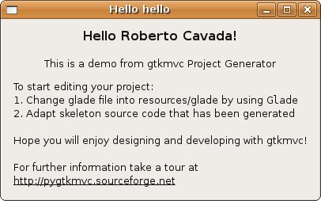

.. include:: common.rst 

Generating a standard project from scratch
==========================================

Since version 1.2.0 a little application called *gtkmvc-progen*
is available to help setting up from scratch a new application based
on |pygtkmvc|. *gtkmvc-progen* is available both as a command-line
program and as a GUI application. 

.. figure:: images/progen.png
   :width: 12cm
   
   *gtkmvc-progen* GUI at work

By the way, the source code of *gtkmvc-progen* is simple and can
be exploted to learn more about gtkmvc-based applications. A model
carries out all the work, and a controller/view pair provides the
GUI if needed.

*gtkmvc-progen* can be executed either locally from the script
directory, or can be executed as any other program if |pygtkmvc| has
been officially installed on the hosting system.

From the local script directory: ::

 $> python gtkmvc-progen name=hello author="Roberto Cavada" gui=no
 
If |pygtkmvc| was installed: ::

 $> gtkmvc-progen name=hello author="Roberto Cavada" gui=no

"name=hello" is an example of setting of a property that customizes the
way *gtkmvc-progen* works. See the user manual for a full list. 

A new directory called ``hello`` will be created in the current
directory (as property *destdir* is "." by default. 

Let us run now the resulting application skeleton. ::

 $> cd hello
 $> ls
 hello.py  resources  src
 
 $> python hello.py

   
   The skeletal hello application
