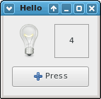
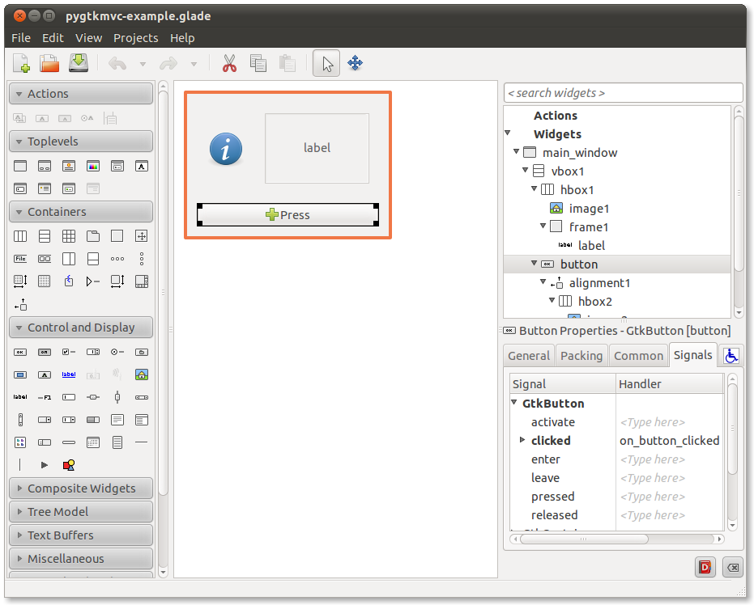
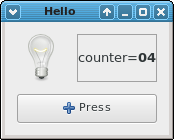

.. _step1:

########################
A short tutorial: Step 1
########################

.. include:: common.rst 

.. Important::

   All the code presented here can be found in the distributed examples. 

The example in few words
========================
The sample application must provide a single window, with a label
showing the value of a numeric counter. The window contains also a
button, which increments the counter by one every time it is pressed.

   
   How the mini-application looks like

Since this tutorial must fit into few pages, the example is extremely
simple. Moreover, a more convoluted example would not help to better
understand what |pygtkmvc| can be used for.

The framework
=============
The implementation of this example is split into three distinct
parts. First, the |gui| is constructed from a |glade| file. Second,
the |gui| is constructed *by hand*, by creating and connecting
manually all widgets. Third, adapters are applied to make the code
much easier.

Hand-made view is mainly presented to make this tutorial more
complete, but the readers should keep in mind that they are going to
adopt the former most of the times, or even more often a mixture of
them, where many parts come from one or more glade files, and some
others are built manually.

The use of glade files is also the reason why the |pygtkmvc| framework
is split into three distinct parts. It is a matter of fact that in
practice the Model-View-Controller pattern will almost always collapse
to a two-level framework, where the View and the Controller are
represented by a unique monolithic entity (let's call it |vc|),
and the Model is still separated by the rest.

The |pygtkmvc| framework provides three well-distinguishable levels, to
allow the pure-glade parts to go into the View side (in a direct and
very natural way), and all the remaining parts that would be put in
the |vc| part, to go either in the Controller part, or in the View
part, depending on how much close to the |gui| stuff are.

For example, all the widgets signal handlers must go in the Controller
side, whereas the code that sets some attributes of a specific widget
might live either in the Controller or in the View, depending on how
much those attributes are bounded to the application logic.

The more some code depends on the logic of the application, the
farther it lives from the View side. If some code depends only on the
logic without any relation with the |gui| stuff, it must live in the
Model.

The implementation glade-based
==============================

The model
---------
The model is represented by class ``MyModel``, derived from
class ``Model``, that in turn is provided by the framework.

The class ``MyModel`` contains a field called
``counter`` to hold the value of a numeric counter. Since we
are interested in monitoring and show any change of this counter, we
declare it as an *observable property*. ::

 from gtkmvc import Model
 
 class MyModel (Model):
     # observable properties:
     counter = 0
     __observables__ = ('counter',)
 
     pass # end of class

All that it is required to do, is calling class ``Model``'s
constructor from within the derived class' constructor, and
defining a class variable ``__observables__`` containing
the name of the observable properties. The base class
``Model`` will do all the boring work automatically.

Names in ``__observables__`` can contain wilcards, see
the user manual for further information.

The glade-based view
--------------------
|glade| while editing the example is depicted in figure
:ref:`glade-figure`. The names for the main window, the label and the
button are significant, and signal clicked of the button has been
associated with a function called ``on_button_clicked``.

.. note:: 
   Since version 1.99.1 `gtk.Builder` glade format is supported
   by view along with old `glade` format.

.. _glade-figure:

   
   Glade at work

The result is saved in file ``pygtkmvc-example.glade``.

The view is represented by class ``MyView``, that derives from
class ``View`` provided by |pygtkmvc|. The class ``View``
can be thought as a container that holds a set of widgets, and may
associate each widget with a string name. When a glade file is used to
build the view, each widget will be associated automatically inside
the view with the corresponding name occurring in the glade file.

Later, each ``View`` instance is connected to a
corresponding ``Controller``, and when built from a glade file,
methods inside the ``Controller`` will be scanned to try to
connect automatically all signals declared in the glade file. ::

 from gtkmvc import View
 class MyView (View):
    def __init__(self):
       View.__init__(self, builder="pygtkmvc-example.glade")
       return

    def set_text(self, text):
        self['label'].set_text(text)
        return
    pass # end of class

Class ``MyView`` calls simply ``View``'s class constructor from within
its constructor, by passing the glade file name, either with the
keyword argument `builder` for :class:`gtk.Builder` format, or keyword
argument `glade` for the old |glade| format. All the hard work is
carried out by class ``View``.

Most of the time user's views are like class ``MyView`` here: they
derive from ``View`` and simply call View's constructor by passing
glade filename and possibly name of top-level widget. In this
situation, it is possible to use a much compact declaration for views::

 from gtkmvc import View
 class MyView2 (View):
    builder = "pygtkmvc-example.glade"

    def set_text(self, text):
        self['label'].set_text(text)
        return
    pass # end of class

Attributes `builder`, `glade` and `top` can be overridden by using the
corresponding keyword arguments when calling the constructor::

    ...
    v = MyView2(builder='a-different-pygtkmvc-example.glade')

The controller
--------------
The controller - so to speak - is the most complicated part of this
example. It is the only part of the |mvc| which knows the model and the
view instances which it is linked to. These are accessible via members
``self.model`` and ``self.view`` respectively. ::
  
 # This is file ctrl_glade.py
 from gtkmvc import Controller
 import gtk
 
 class MyController (Controller):
     def __init__(self, model, view):
         Controller.__init__(self, model, view)
 
         # The controller is an observer for properties contained in
         # the model:
         return
 
     def register_view(self, view):
         """This method is called by the view, that calls it when it is
         ready to register itself. Here we connect the 'pressed' signal
         of the button with a controller's method. Signal 'destroy'
         for the main window is handled as well."""
 
         # connects some signals manually:
         self.view['main_window'].connect('destroy', gtk.main_quit)
         
         # initializes the text of label:
         self.view.set_text("%d" % self.model.counter)
         return
        
     # signals:
     def on_button_clicked(self, button):
         self.model.counter += 1  # changes the model
         return
 
     # observable properties:
     @Controller.observe("counter", assign=True)
     def counter_change(self, model, prop_name, info):
         self.view.set_text("%d" % info.new)
         print "Property '%s' changed value from %d to %d" \
	   % (prop_name, info.old, info.new)  
         return
     
     pass # end of class

In the class constructor, at first base class constructor is called,
passing the ``Model`` instance this ``Controller``
instance belongs to. From that moment on, class member self.model will
be accessible. 

``Controller``'s base class ``Observer`` calls method
``Model.register_observer`` in order to make the controller an
observer for the observable property ``counter`` in the model. After
this, every change applied to ``MyModel`` class' member ``counter``
will make method ``counter_change`` of class ``MyController`` be
called automatically.  In fact, the method has been registered as a
notification method for assignments with the decorator
`@Controller.observe`.

At construction time also the ``View`` instance is passed,
to be registered to be the view of the controller.

Method ``register_view`` is called when a class
``View`` instance requires to be registered to the controller
it belongs to. This method is mainly used to connect signals and
initialize the |gui| side that depends on the application logic. In
the example, signal ``"destroy"`` of the main window is
connected to ``gtk.main_quit`` to close the application when
the user closes the window. Notice here the use of member
``self.view`` and how a class ``View`` can be used as
a map to retrieve widgets from their names.

Also, the text label is initialized to the initial value of the
counter.

Method ``on_button_clicked`` is called as a callback every
time the user clicks the button. The corresponding signal is
automatically connected to this method when class ``MyView``
registers itself within the controller.

Finally, method ``counter_change`` is called when the property counter
in class ``MyModel`` changes (gets assigned to a different value). The
model containing the property, the name of the property, and a
structure carrying other information (e.g. the old and new value) are
passed to this method. Notice that the model is passed since the
controller might be an observer for more than one model, even
different from the model it is directly connected to in the |mvc|
chain.

The main code
-------------
Main code is pretty trivial: ::
  
 # This is file main_glade.py
 import gtk
 from model import MyModel
 from ctrl_glade import MyController
 from view_glade import MyView
 
 m = MyModel()
 v = MyView()
 c = MyController(m, c)
 
 gtk.main()

A triple MVC is created, and main loop is started. 

The implementation without glade
================================

The model
---------
The model does not depend on the controller+view sides, so it is
exactly the same as for the implementation glade-based.

The view
--------
Using manually constructed views is slightly less intuitive that using
glade-based views, since the architecture of the view-side |pygtkmvc|
is mainly designed to be used with glade files. ::

 # This is file view_no_glade.py
 from gtkmvc.view import View
 import gtk
 
 class MyViewNoGlade (View):
 
     def __init__(self):
         # The view here is not constructed from a glade file.
         View.__init__(self)
 
         # The set of widgets:
         w = gtk.Window()
         h = gtk.VBox()
         l = gtk.Label()
         b = gtk.Button("Press")
         h.pack_start(l)
         h.pack_end(b)
         w.add(h)
         w.show_all()
 
         # We add all widgets we are interested in retrieving later in
         # the view, by giving them a name. Suppose you need access
         # only to the main window, label and button.  Widgets are
         # added like in a map:
         self['main_window'] = w
         self['label'] = l
         self['button'] = b         
         return
 
     def set_text(self, text):
         self['label'].set_text(text)
         return

     pass # end of class

The entire work is carried out by the View's constructor which can
be exploited to manually construct all the widgets set.

Following lines are used to build the widgets set, and to associate a
few of them with string names (only those that will have to accessed
later).

Notice that here |glade| file has not been used at all. Nevertheless, a
mixed solution where |glade| file(s) and manually constructed widgets
sets is fully supported.

The controller
--------------
The controller is the same that has been used for the glade-based
version, a part from a further signal connection that is performed to
connect the button "``clicked``" event to class method
``self.on_button_clicked``. For this reason, class
``MyControllerNoGLade`` is derived from class
``MyController`` to reduce typing. ::

 # This is file ctrl_no_glade.py
 from ctrl_glade import MyController
 
 class MyControllerNoGlade (MyController):
 
     def register_view(self, view):
         # connects the signals:
         self.view['button'].connect('clicked', self.on_button_clicked)
         return    
     
     pass # end of class

The main code
-------------
Like previous version, main code for manually built view is very
short: ::

 # This is file main_no_glade.py
 import gtk
 from model import MyModel
 from ctrl_no_glade import MyControllerNoGlade
 from view_no_glade import MyViewNoGlade
 
 m = MyModel()
 v = MyViewNoGlade()
 c = MyControllerNoGlade(m,v)
 gtk.main()

Multiple views, one model
=========================
This example shows the powerful of the |obs|.

Here both the glade-based and manually built versions are being run at
the same time, with a single instance of class ``MyModel``
shared between those two versions. The execution of this example
results in two windows being displayed; by clicking the button of one
of them, the counter is incremented, and the labels in both of them
are updated. ::

 # This is file main_mixed.py
 import gtk
 from model import MyModel
 from ctrl_no_glade import MyControllerNoGlade
 from ctrl_glade import MyController
 from view_no_glade import MyViewNoGlade
 from view_glade import MyView
 
 m = MyModel()
 v1 = MyViewNoGlade()
 c1 = MyControllerNoGlade(m,v1)
 v2 =  MyView()
 c2 = MyController(m,v2)
 gtk.main()

Using Adapters
==============
Since version 1.2 adapters largely contribute to make the code
simpler and so to reduce development costs and efforts.

Adapters *adapt* some part of the model to some part of the
view. In a simple version, one adapter makes one property (possibly
observable) into the model communicate autonomously with a single
widget into the view, and viceversa. Readers can find all
information about adapters in the user manual.

We want to have an adapter to handle coordination between property
``counter`` and the label. Model and View remain
unchanged. It is the Controller that can be simplified as follows: ::

 # This is file ctrl_glade_adap.py
 from gtkmvc import Controller
 import gtk
 
 class MyControllerAdap (Controller):
     def register_view(self, view):
         # connects the signals:
         self.view['main_window'].connect('destroy', gtk.main_quit)
         return
 
     def register_adapters(self):
         self.adapt("counter", "label")
         return
        
     # signals:
     def on_button_clicked(self, button):
         self.model.counter += 1  # changes the model
         return    
     pass # end of class

Controller method ``register_adapters`` is called by the
framework when adapters can be instantiated. The controller is no
longer interested in observing property ``counter`` and to
initialize the value shown in the label, as these activities are now
transparently carried out by the adapter.

Notice that if editable widget like a text entry were used instead
of a label, the adapter would also have taken care about changes of
the text entry reporting them to the property. 

Now suppose you want to apply some customization to the way the
label shows the property's value. Method
``register_adapters`` might be: ::

    from gtkmvc import adapters
    def register_adapters(self):
        a = adapters.Adapter(self.model, "counter")
        a.connect_widget(self.view['label'], 
             setter=lambda w,v: 
               w.set_markup("<big>Counter=<b>%02d</b></big>" % v))
        self.adapt(a)
        return

   
   Adapter at work

Here an adapter is created explicitly, and parameter
``setter`` is used to custom the functional block that is in
charge of writing to the widget.

There are several types of adapters that can be used, depending on
the property kind and the widget type they adapt. Adapter offer a
very straight and simple default support, but they can be largely
customized when needs get more advanced. See the user manual for
further information.

What's next?
============

Are you ready for a jump ahead? Go to the :ref:`second part<step2>` of this
tutorial.
