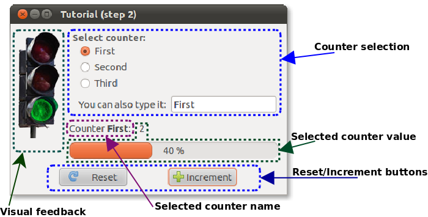
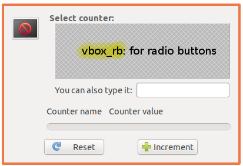
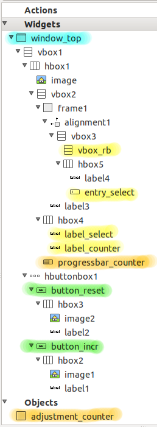

.. _step2:

########################
A short tutorial: Step 2
########################

.. include:: common.rst 

In :ref:`first part<step1>` we have seen a simple example. 

In this section we will see a more complex example. In particular we
will make an more advanced use of :ref:`adapters`, and :ref:`OP_log`
with :ref:`OP_log_deps`.

.. Important::

   All the code presented here can be found in the distributed examples. 

The example illustrated
=======================

In this example, we want to show a set of *counters*. Below are listed
the requisites.

Requisites about the *logic*
----------------------------

1. There are a variable number of counters in the set.

2. Each counter is identified by a unique name. 

3. Each counter counts from 0 to a maximum number (which may depend on
   the specific counter).

4. Each counter must be selected (through its name) before being used.

5. Each counter can be reset (to 0) and incremented (by 1). When the
   maximum number is reached, any further increment produces no
   effects.

Requisites about the *view*
---------------------------

6. The user can selects the current counter.

7. The user can increment and reset the currently selected counter.

8. The user sees the currently selected counter, and its current value. 

9. The user receives feedback when the counter is closed to the
   maximum value, and when it reached the maximum value.

.. _fig_appl2:

   How the view looks like

Here you can see how the application looks like, and the highlighted
regions have correspondences in the view requisites 6-9.

The model code
==============

Here follows the code of the model which implements this logic:

.. literalinclude:: ../../examples/tutorial/step2/model.py
   :linenos: 
   :lines: 14-

Line 12
     Class member `counter_names` is used to declare the number and
     names of available counters.

Lines 15-19
      Observable properties (OP) are declared. OP `counter` is a
      logical property.

Line 26
     Initial value of OP `counter_select` is chosen randomly to make
     thinks a little more funny.

Lines 31-39
      Define the getter and setter of the logical OP `counter`. Notice
      that `counter` is declared to be dependent on `counter_select`,
      meaning that when `counter_select` is changed, all the observers
      of `counter` will be notified as well. This is important as when
      the selector of the current counter is changed, it is needed 
      to show also the *value* of the newly selected counter.

      Also notice that the counter returns `0` if the selected counter
      is not known.

Lines 43-59
      Remaining lines are to implement getter and setter of the
      counter.

The glade file
==============

.. _fig_step2_window:

   The main window in |glade|

.. _fig_step2_hierarchy:

   The widgets and objects in |glade|

In picture :ref:`fig_step2_window` you can see how the main top level
window looks like in |glade|. Here the format chosen is `gtk.Builder`
as objects are needed as well (see :ref:`fig_step2_hierarchy` below).

The big area in the middle is represented by the `gtk.VBox` widget
named `vbox_rb` and its purpose is to contain the radio buttons for
selecting the current counter.

Here requisite 1 specifies that the number of counters is *variable*,
meaning that it cannot be determined statically. For this reason the
view will be filled with the required radio buttons when the view
will be instantiated and connected to the model which contains the
actual counters.

The top level window contains also:

* A `gtk.Label` for the name of the currently selected
  counter (`label_select`).

* A `gtk.Label` for the value of the currently selected
  counter (`label_counter`).

* A `gtk.ProgressBar` for the value of the currently
  selected counter. (*Name does not matter*)

* A `gtk.Image` for giving feedback to the user about the value of the
  currently selected counter (`image`).

* A `gtk.Entry` as an alternative way of selecting the current counter
  (`entry_select`). 

* A `gtk.Button` to reset the value of the counter. Signal `clicked`
  is attached to callback `on_button_reset_clicked`. (*Name does not
  matter*)

* A `gtk.Button` to increment the value of the counter. Signal
  `clicked` is attached to callback `on_button_incr_clicked`. (*Name
  does not matter*)

There is also an object:

* A `gtk.Adjustment` used to control the value of the progress bar
  which is connected to it (`adjustment_counter`).

The view code
=============

.. literalinclude:: ../../examples/tutorial/step2/view.py
   :linenos: 
   :lines: 14-

Lines 5,6
      Define the glade file (`gtk.Builder` format).

Lines 11-13
      Create `gtk.gdk.Pixbuf` to be used later with `image`.

Lines 31-41
      Create needed `gtk.RadioButton` and pack them into `vbox_rb`.
      All the radio buttons belongs to the same group. Notice that the
      labels of the radio buttons are taken from the passed list of
      names, and that names are also used to give names to the radio
      buttons (prefixed with `rb_`).

Line 44
     Sets up the adjustment depending on the maximum value passed to
     the function. This is done when a model is connected to the view,
     as the maximum value depends on the model.

Lines 49-51
     Make `image` show either the red, yellow or green traffic light,
     respectively.

As you see, the view is pretty simple and linear.

The controller code
===================

The complexity of the required interactions would make the controller
quite complex, but fortunately we have adapters which make a great
work for us.

.. literalinclude:: ../../examples/tutorial/step2/ctrl.py
   :linenos: 
   :lines: 14-

Line 9
     Connection to handle quitting of the application.

Line 10
     Since `register_view` is the moment when the view is connected to
     the controller, it is time to call `MyView.setup_content` to
     build the `gtk.RadioButton` and setup the `gtk.ProgressBar`. The
     names of the counters are passed down.

Lines 15-21 
     In `MyCtrl.register_adapters` which is called when it is time to
     create all the adapters. Here `gtkmvc.Controller.adapt` is used
     to adapt OPs in the model and some widgets in the view.

     .. Note::

        Notice at lines 15,16 that all radio buttons are connected to
        the same OP `counter_select`. When a `gtk.RadioButton` is
        adapted, the label of the button is taken and stored into the
        OP when that radio button is toggled on. 
                
        The connection made by the adapter works in both directions:
        try to change the text in `entry_select` to prove it: if it
        matches the label of a radio button, that radio will get
        toggled on. What happens? 

        1. `entry_select` is adapted to the OP `counter_select`, so 
           when you change the text in `entry_select`,
           `counter_select` will change accordingly.

        2. Since radio buttons `rb_*` and label `label_select` are
           adapted to `counter_select` as well, the label will show
           the new value, and if a match in radio button's label is
           found, the corresponding radio button will get toggled on.

Lines 24-28
     In previous lines we exploited `gtkmvc.Controller.adapt` which
     when called in that manner internally makes some magic to
     simplify our life. In particular it automatically creates a
     `gtkmvc.adpaters.Adapter` which actually makes the work of
     adapting an OP and a widget.

     However, to adapt the OP `counter_select` and the label
     `label_select` we wanted to apply some special markup, so have to
     manually create an `Adapter`, and pass it to `adapt` as unique
     parameter.

Lines 35,36
     Signal handling for buttons `clicked` signals.

Line 42
     A notification is declared for the OP `counter`. The notification
     is called when the OP is assigned.

Lines 43-51
     This notification is used to provide to the user a visual
     feedback depending on the value of the currently selected
     counter. The feedback is provided through an traffic light image.

     Also, when a counter reached the maximum value, the button for
     incrementing the value is made insensitive.

The main code
=============

The main code is trivial as usual:

.. literalinclude:: ../../examples/tutorial/step2/main.py
   :lines: 13-

And here you can see the result in all its beauty. The user
interaction is particularly rich and robust, although the complexity
of the code is quite low. 

+----------------------------------------+----------------------------------------+
| .. image:: images/step2_run1.png       | .. image:: images/step2_run2.png       |
|    :width: 8 cm                        |    :width: 8 cm                        |
|    :align: center                      |    :align: center                      |
|                                        |                                        |
| Right after starting                   | `First` counter after a few            |  
|                                        | increments.                            |
+----------------------------------------+----------------------------------------+
| .. image:: images/step2_run3.png       | .. image:: images/step2_run4.png       |
|    :width: 8 cm                        |    :width: 8 cm                        |
|    :align: center                      |    :align: center                      |
|                                        |                                        |
| No available values for counter        | After selecting a different            |
| `First`                                | counter                                |
+----------------------------------------+----------------------------------------+

What have we learnt?
====================

First of all we have seen the advantages and strength of logical
observable properties.

Second, the advantages of having separated entities to represent the
logic, the aspect and the controller of an application.

Third, I hope that this example clearly shows that complex
interactions can be reduced largely by exploiting observable
properties. Complexity in controllers can be reduced by using
adapters, which make code smaller and allow you to focus on the big
picture and forget about the details.

For example, the user can select a different counter by selecting a
radio button, or typing the counter name in the `gtk.Entry`. This is a
detail you don't really mind if you use adapters, the only important
result is that a member of your model class will be changed
accordingly.

After the user selected a new counter, you don't have to worry about
showing the counter value explicitly, in the label, in the progress
bar, or in the image. Since those widgets are adapted to the counter
value, the value is shown correctly whatever is the reason why it got
changed. In fact the value could change because it was reset, or
incremented, or because the user selected a different counter. In the
controller there is no code handling these different cases, which are
inherently handled implicitly.

In conclusion: you get less headaches and complexity, more robustness,
and more freedom to think about the big picture, which is what really
matters, doesn't it?
