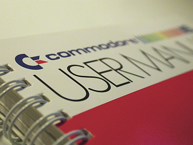

.. include:: common.rst 

.. _documentation:

=============
Documentation
=============

|pygtkmvc| is very well documented. However documentation is currently
evolving in order to improve readability and to become more effective
for the user.

There are five source of documentation ready for you:

1. |pygtkmvc| in 5 minutes 

   Use online to catch a glimpse of |pygtkmvc|.

2. Quick Start Guide (aka |pygtkmvc| in 45 minutes) 

   This is the document where you should begin from.

3. The User Manual 

   This is the complete guide that should be read after the Quick Start Guide.

4. The Tutorial 

   This practical guide is under restructuring. Although being a
   pretty naive toy example, it should be an interesting reading for
   those who prefer a non-exhaustive approach at first, but prefer a
   practical overview.

5. The Programmer's Library Reference 

   This is the development documentation, extracted out of source
   code. Keep it under your pillow when programming your application.

6. Examples, and source code 

   There is a bunch of examples coming along with the source
   distribution. Also remember that |pygtkmvc| is Free Software, and
   all its source code is available freely for study and inspiration.

Downloading documents
---------------------

All documents are available both in html and pdf, for online and
offline reading.

For downloading documents see `here <http://sourceforge.net/project/showfiles.php?group_id=123428>`_.

Contacts, help, request features and bug reports
------------------------------------------------

For contacting the author, the community or submit bug reports, see
:ref:`top_contacts`.
